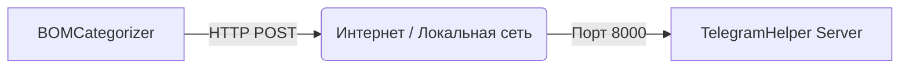

# 🔌 Управление Портами: BOMCategorizer ↔ TelegramHelper

Этот документ описывает сетевое взаимодействие между клиентом (BOMCategorizer) и сервером (TelegramHelper), а также инструкции по смене портов.

---

## 1. Архитектура по умолчанию

По умолчанию обмен данными происходит через порт **8000**.



*   **Протокол**: HTTP (или HTTPS, если настроен прокси)
*   **Endpoint**: `/ai_query/secure` (для зашифрованного трафика)
*   **Порт по умолчанию**: `8000`

---

## 2. Как изменить порт?

Для успешной работы порт должен быть **одинаковым** (синхронизированным) на стороне Клиента и Сервера (внешний порт).

### 🅰️ На стороне Сервера (TelegramHelper)

Сервер работает в Docker контейнере. Чтобы изменить порт, который "слушает" сервер, нужно отредактировать файл `docker-compose.yml` (или `compose.yaml`).

1.  **Откройте файл на сервере:**
    ```bash
    nano /opt/TelegramHelper/docker-compose.yml
    ```

2.  **Найдите секцию `ports` для сервиса `telegram-api`:**
    ```yaml
    services:
      telegram-api:
        # ...
        ports:
          - "8000:8000"  # <--- ВНЕШНИЙ:ВНУТРЕННИЙ
    ```

3.  **Измените ВНЕШНИЙ порт (первое число):**
    Например, чтобы сменить на **9090**:
    ```yaml
        ports:
          - "9090:8000"
    ```
    *Важно: Второе число (`8000`) не меняйте, это внутренний порт приложения внутри контейнера.*

4.  **Примените изменения:**
    ```bash
    docker compose up -d
    ```

Теперь сервер доступен по адресу: `http://IP_ВАШЕГО_СЕРВЕРА:9090`

---

### 🅱️ На стороне Клиента (BOMCategorizer)

В приложении BOMCategorizer порт можно изменить двумя способами.

#### Способ 1: Через Графический Интерфейс (Рекомендуемый)

1.  Откройте меню **Поиск PDF** -> **Настройки API ключей** (или нажмите иконку ⚙️).
2.  Перейдите на вкладку **API Ключи**.
3.  В секции **Telegram Bot**:
    *   Найдите поле **Порт**.
    *   Измените значение (например, на `9090`).
    *   *Примечание: При изменении порта URL обновится автоматически.*
4.  Нажмите **ОК** для сохранения.

#### Способ 2: Через файл конфигурации

1.  Закройте BOMCategorizer.
2.  Откройте файл `config_qt.json` в корне программы.
3.  Найдите секцию `api_keys`:
    ```json
    "api_keys": {
      "telegram_url": "http://YOUR_SERVER_IP:9090/ai_query",
      "telegram_key": "..."
    }
    ```
4.  Измените порт в строке `telegram_url`.
5.  Сохраните файл.

---

## 3. Синхронизация (Важно!)

⚠️ **Правило:** Порт, указанный в настройках BOMCategorizer, должен **совпадать** с внешним портом, открытым в Docker на сервере.

| TelegramHelper (Docker) | BOMCategorizer (Settings) | Статус |
| :--- | :--- | :--- |
| `8000:8000` | `http://...:8000` | ✅ Работает |
| `9090:8000` | `http://...:9090` | ✅ Работает |
| `9090:8000` | `http://...:8000` | ❌ Ошибка подключения |

### 4. Настройка Фаервола (Firewall)

Если контейнер запущен, но подключения нет, скорее всего порт закрыт фаерволом на сервере (VPS).

#### Проверка текущих правил (UFW)
Ubuntu/Debian часто используют `ufw` (Uncomplicated Firewall).

```bash
sudo ufw status
```

Если статус `active`, вам нужно разрешить новый порт.

#### Открытие порта
Если вы сменили порт на **9090**, выполните:

```bash
sudo ufw allow 9090/tcp
sudo ufw reload
```

#### Проверка открытых портов (netstat/ss)
Убедитесь, что система действительно "слушает" этот порт:

```bash
# Показать все слушающие порты
sudo ss -tulpn | grep LISTEN

# Или конкретно ваш порт
sudo ss -tulpn | grep 9090
```
Вы должны увидеть строку вроде `0.0.0.0:9090 ... docker-proxy`.

#### Если используется iptables (без UFW)
На некоторых серверах `ufw` отключен, и используется чистый `iptables`.
Docker обычно сам добавляет правила, но иногда нужно добавить вручную:

```bash
iptables -I INPUT -p tcp --dport 9090 -j ACCEPT
```

#### Проверка доступности снаружи
С вашего локального компьютера (Mac) можно проверить доступность порта на сервере через `nc` (netcat):

```bash
nc -zv YOUR_SERVER_IP 9090
```
*   `Connection to ... succeeded!` — Порт открыт и доступен.
*   `Connection refused` — Порт закрыт (никто не слушает) или заблокирован.
*   `Operation timed out` — Порт заблокирован фаерволом (пакеты отбрасываются).
