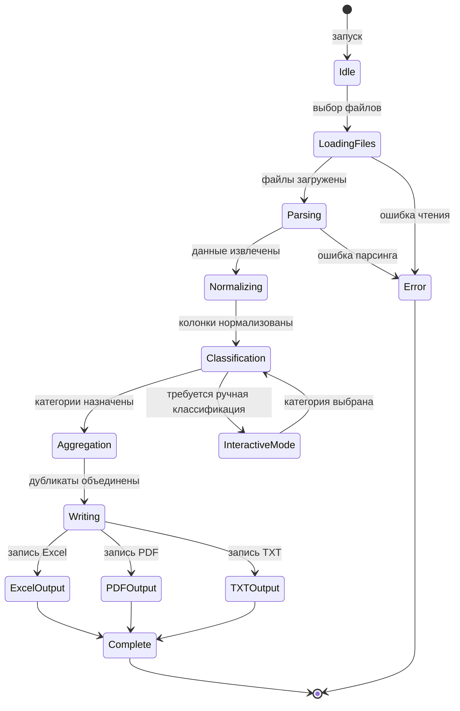
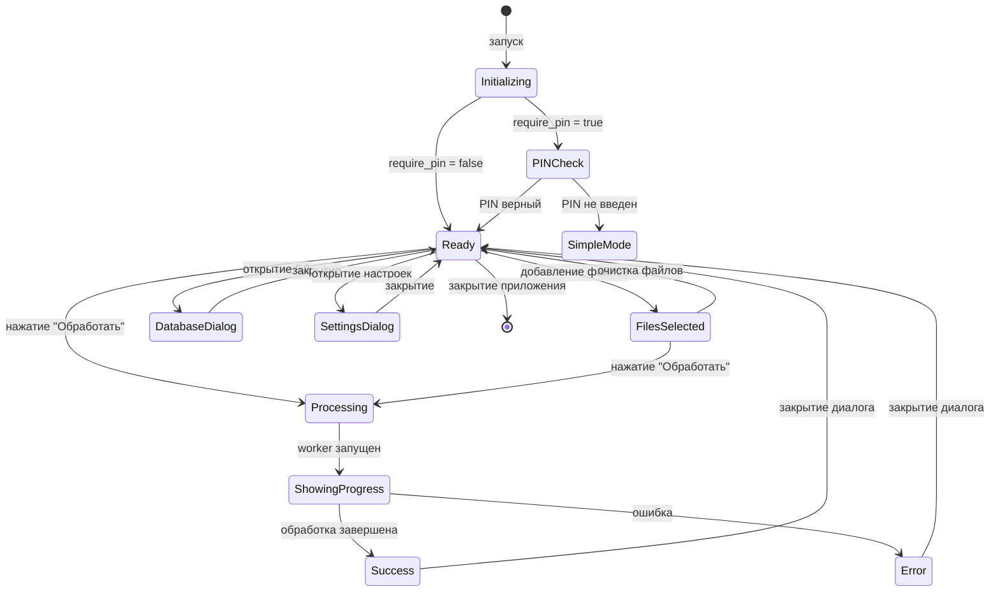
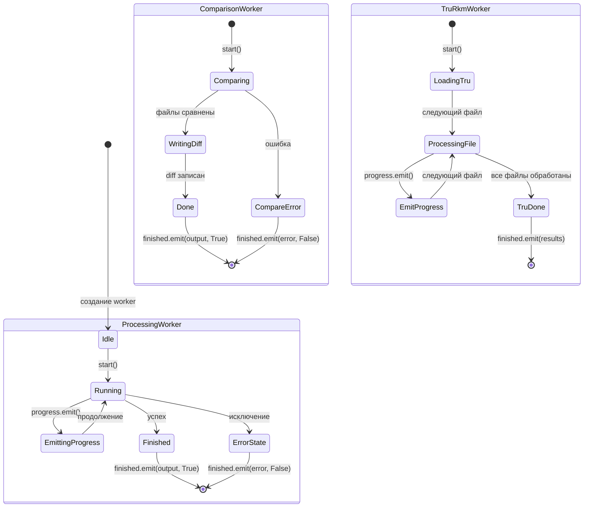
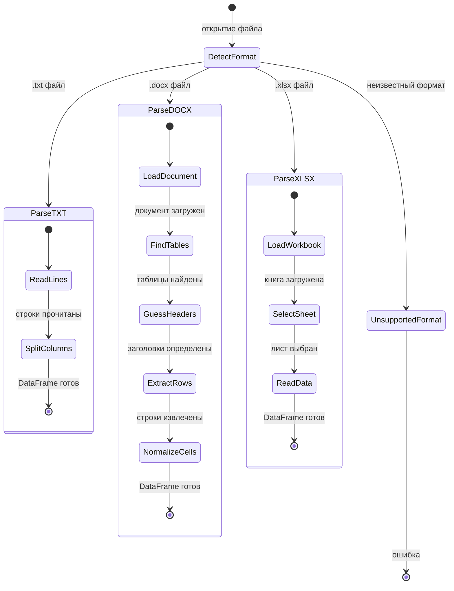
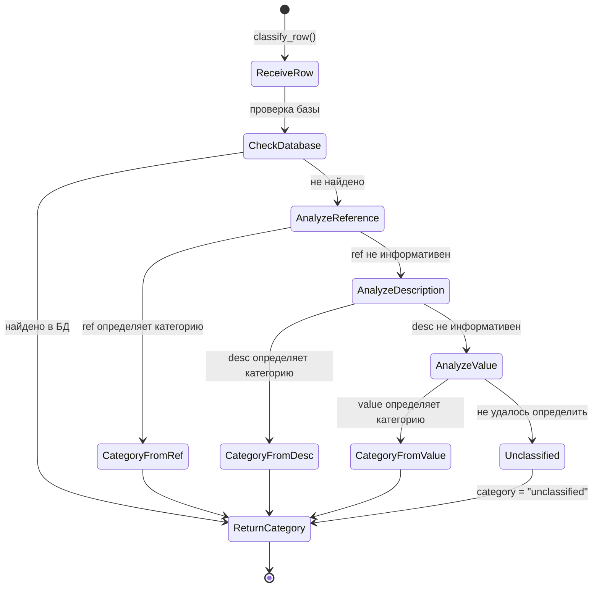
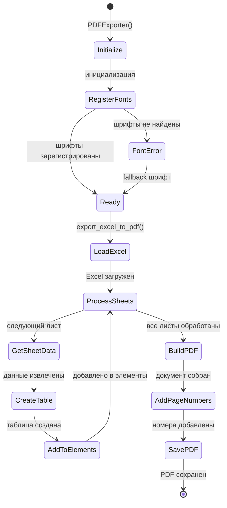

# State-Machine Diagrams for BOMCategorizer

Диаграммы состояний для основных компонентов приложения BOMCategorizer.

---

## 1. BOM Processing Pipeline (CLI)

Основной поток обработки BOM файлов в [main.py](file:///Users/olgazaharova/Project/ProjectPython/BOMCategorizer/bom_categorizer/main.py):



---

## 2. GUI Application States (Qt / Tkinter)

Состояния главного окна в [main_window.py](file:///Users/olgazaharova/Project/ProjectPython/BOMCategorizer/bom_categorizer/gui/main_window.py) и [gui.py](file:///Users/olgazaharova/Project/ProjectPython/BOMCategorizer/bom_categorizer/gui.py):



---

## 3. Worker Thread States

Состояния фоновых потоков в [workers.py](file:///Users/olgazaharova/Project/ProjectPython/BOMCategorizer/bom_categorizer/gui/workers.py):



---

## 4. File Parser States

Состояния парсеров в [parsers.py](file:///Users/olgazaharova/Project/ProjectPython/BOMCategorizer/bom_categorizer/parsers.py):



---

## 5. Classification Engine States

Состояния классификатора в [classifiers.py](file:///Users/olgazaharova/Project/ProjectPython/BOMCategorizer/bom_categorizer/classifiers.py):



---

## 6. PDF Export States

Состояния экспортера в [pdf_exporter.py](file:///Users/olgazaharova/Project/ProjectPython/BOMCategorizer/bom_categorizer/pdf_exporter.py):



---

# 📋 Правила классификации компонентов BOM

---

## 📌 Оглавление

1. [Обзор системы классификации](#-обзор-системы-классификации)
2. [Приоритеты классификации](#-приоритеты-классификации)
3. [Категории компонентов](#-категории-компонентов)
4. [Алгоритм классификации](#-алгоритм-классификации)
5. [Таблица префиксов](#-таблица-префиксов)
6. [Ключевые слова по категориям](#-ключевые-слова-по-категориям)
7. [Примеры классификации](#-примеры-классификации)

---

## 🎯 Обзор системы классификации

Система автоматически классифицирует электронные компоненты (ИВП - Изделия Электронной Промышленности) по категориям на основе:

- **Позиционных обозначений** (reference designators): R1, C5, D10, U2 и т.д.
- **Ключевых слов** в наименовании и описании компонента
- **Групповых заголовков** из DOCX файлов (секции "Микросхемы", "Резисторы" и т.д.)
- **Базы данных компонентов** для точного соответствия
- **Номиналов** (100 Ом, 10 пФ, 1 мкГн)
- **Производителей** и специфичных серий (Mini-Circuits, Analog Devices и т.д.)

---

## 🔢 Приоритеты классификации

Система проверяет критерии в строгой последовательности. При первом совпадении компонент относится к соответствующей категории.

### **Порядок приоритетов (от высшего к низшему):**

#### **ПРИОРИТЕТ 0: Служебные записи (НЕ ИВП)**
- **Критерий:** Отсутствие позиционного обозначения + служебные слова
- **Примеры слов:** "изм.", "лист регистрации", "подпись", "формат", "дата", "проверил", "утвердил", "масса", "масштаб", "штамп"
- **Результат:** Категория `non_bom` (не попадает в выходной файл)
- **Назначение:** Фильтрация рамок документов, штампов, подписей

#### **ПРИОРИТЕТ 1: База данных компонентов**
- **Критерий:** Точное совпадение наименования в JSON базе `component_database.json`
- **Примеры:** "К10-17в-М1500-25В-10%-К50-В", "C0603C0G1E102J030BA"
- **Результат:** Категория из базы данных
- **Назначение:** Гарантированная корректная классификация для известных компонентов

#### **ПРИОРИТЕТ 2: Наши разработки**
- **Критерий:** Наличие в описании кодов `195-`, `АМФИ`, `ГВАТ`, `ШСК-М`, `БЗ`, `БФ`
- **Исключения:**
  - Стандартные ЭРИ (резисторы, конденсаторы с кодом АМФИ - это покупные компоненты)
  - Вентили СВЧ с ГВАТ (классифицируются как "СВЧ модули")
- **Примеры:** 
  - ✅ "Плата контроллера ШСК-М 195-9530-3323/21"
  - ✅ "БЗ ШСК-М АМФИ.434825.003"
  - ❌ "Резистор Р1-4 536 Ом АМФИ.467512.002" → "Резисторы"
  - ❌ "Вентиль ГВАТ.434823.015" → "СВЧ модули"

#### **ПРИОРИТЕТ 3: Явные типы компонентов**
- **Критерий:** Наличие в описании явных слов-маркеров типа
- **Примеры:**
  - "Резистор", "Resistor" → "Резисторы"
  - "Конденсатор", "Capacitor" → "Конденсаторы"
  - "Микросхема", "IC", "Микродроссель" → соответствующие категории
- **Назначение:** Гарантированная классификация при явном указании типа

#### **ПРИОРИТЕТ 4: Групповые заголовки (для DOCX)**
- **Критерий:** Компонент находится под заголовком секции в DOCX документе
- **Примеры заголовков:** "Микросхемы", "Резисторы", "Конденсаторы", "Разъемы"
- **Важно:** Этот приоритет **ВЫШЕ** определения по префиксу
- **Пример:**
  ```
  Микросхемы          ← групповой заголовок
  D1  1272ПН3Т       → "Микросхемы" (несмотря на префикс D)
  D2  5019ЧТ2Т       → "Микросхемы"
  ```

#### **ПРИОРИТЕТ 5: Префиксы позиционных обозначений**
- **Критерий:** Первые буквы позиционного обозначения (R1, C5, D10 и т.д.)
- **См. подробную таблицу префиксов ниже**

#### **ПРИОРИТЕТ 6: Ключевые слова в описании**
- **Критерий:** Поиск специфичных ключевых слов для каждой категории
- **См. раздел "Ключевые слова по категориям"**

#### **ПРИОРИТЕТ 7: Номиналы и паттерны**
- **Критерий:** Регулярные выражения для значений (100 Ом, 10 пФ, 1 мкГн)
- **Применение:** Для компонентов без явных маркеров

---

## 📦 Категории компонентов

| Ключ категории | Русское название | Примеры компонентов |
|----------------|------------------|---------------------|
| `ics` | **Микросхемы** | AD9221, HMC435, SN74LVC1G, STM32, FPGA, драйверы |
| `resistors` | **Резисторы** | Р1-12, С2-33, 0805, 100 Ом, металлопленочные |
| `capacitors` | **Конденсаторы** | К10-17, К53-65, 0603, керамические, танталовые |
| `inductors` | **Индуктивности** | Дроссели, трансформаторы, катушки, ферриты |
| `semiconductors` | **Полупроводники** | Диоды, транзисторы, стабилитроны, светодиоды, оптроны |
| `connectors` | **Разъемы** | SMA, RJ45, USB, разъемы питания, клеммники |
| `optics` | **Оптические компоненты** | Оптические модули, патч-корды, аттенюаторы FC/APC |
| `power_modules` | **Модули питания** | DC-DC преобразователи, МДМ, МАА, источники питания |
| `cables` | **Кабели** | Кабели питания, шлейфы, провода, патч-корды (не оптические) |
| `our_developments` | **Наши разработки** | Платы 195-XXXX, блоки АМФИ, модули ГВАТ, ШСК-М |
| `dev_boards` | **Отладочные платы** | Evaluation boards, коммутаторы, модули связи, NT1 |
| `rf_modules` | **СВЧ модули** | Усилители, вентили, аттенюаторы СВЧ, делители мощности |
| `others` | **Другие** | Генераторы, предохранители, кварцы, реле, корпуса |
| `unclassified` | **Не распределено** | Компоненты без достаточных признаков для классификации |
| `non_bom` | **Не ИВП** | Служебные записи, штампы (не попадают в выходной файл) |

---

## 🔄 Алгоритм классификации

### **Общая последовательность проверок:**

```
НАЧАЛО
  │
  ├─ Проверка: Служебная запись? (нет ref + служебные слова)
  │    ├─ ДА → non_bom (фильтруется)
  │    └─ НЕТ → далее
  │
  ├─ Проверка: Есть в базе данных? (description или partname)
  │    ├─ ДА → категория из базы
  │    └─ НЕТ → далее
  │
  ├─ Проверка: Наши разработки? (195-, АМФИ, ГВАТ, ШСК-М)
  │    ├─ ДА → проверка исключений
  │    │    ├─ Стандартный ЭРИ? → далее
  │    │    ├─ Вентиль СВЧ с ГВАТ? → rf_modules
  │    │    └─ Иначе → our_developments
  │    └─ НЕТ → далее
  │
  ├─ Проверка: Явный тип в описании? (резистор, конденсатор, микросхема и т.д.)
  │    ├─ ДА → соответствующая категория
  │    └─ НЕТ → далее
  │
  ├─ Проверка: Оптические компоненты? (оптич*, optical, FC/APC)
  │    ├─ ДА → optics
  │    └─ НЕТ → далее
  │
  ├─ Проверка: Кабели? (кабель, провод, шлейф)
  │    ├─ ДА → cables
  │    └─ НЕТ → далее
  │
  ├─ Проверка: Есть групповой заголовок? (для DOCX)
  │    ├─ ДА → категория по заголовку
  │    └─ НЕТ → далее
  │
  ├─ Проверка: Есть префикс позиционного обозначения?
  │    ├─ ДА → классификация по префиксу (см. таблицу)
  │    └─ НЕТ → далее
  │
  ├─ Проверка: Ключевые слова категорий в описании?
  │    ├─ ДА → соответствующая категория
  │    └─ НЕТ → далее
  │
  ├─ Проверка: Номинал соответствует паттерну? (Ом, пФ, мкГн)
  │    ├─ ДА → соответствующая категория (resistors/capacitors/inductors)
  │    └─ НЕТ → далее
  │
  └─ Результат → unclassified (не удалось классифицировать)
КОНЕЦ
```

---

## 🔤 Таблица префиксов

| Префикс | Категория | Описание | Примеры | Особенности |
|---------|-----------|----------|---------|-------------|
| **R** | Резисторы | Резистор | R1, R10, R100 | Стандарт |
| **C** | Конденсаторы | Конденсатор | C1, C5, C22 | Стандарт |
| **L** | Индуктивности | Индуктивность, дроссель | L1, L3 | Стандарт |
| **D** | Микросхемы ⚠️ | Микросхема (рос. ГОСТ) | D1, D10 | ⚠️ Если в описании "диод", "стабилитрон" → Полупроводники |
| **DD** | Микросхемы | Цифровые микросхемы | DD1, DD5 | Российский ГОСТ |
| **DA** | Микросхемы | Аналоговые микросхемы | DA1, DA3 | Российский ГОСТ |
| **U** | Микросхемы 🔍 | Микросхема | U1, U5 | 🔍 Если "оптический модуль" → Оптика |
| **IC** | Микросхемы | Integrated Circuit | IC1, IC2 | Стандарт |
| **VD** | Полупроводники | Диод, стабилитрон | VD1, VD5 | Российский ГОСТ |
| **VT** | Полупроводники | Транзистор | VT1, VT3 | Российский ГОСТ |
| **V** | Полупроводники | Транзистор | V1, V2 | Если не "микросхем" в описании |
| **Q** | Полупроводники | Транзистор | Q1, Q2 | Стандарт |
| **H** | Полупроводники | Индикатор, светодиод | H1, H2 | Российский ГОСТ |
| **J** | Разъемы | Разъем, джампер | J1, J10 | Стандарт |
| **P** | Разъемы | Разъем, вилка | P1, P5 | Стандарт |
| **K** | Разъемы | Разъем | K1, K2 | Стандарт |
| **X** | Разъемы | Разъем | X1, X3 | Стандарт |
| **XT** | Разъемы | Разъем питания | XT1, XT2 | Специфичный |
| **XW** | Разъемы | Адаптер | XW1, XW2 | Специфичный (адаптеры SMA) |
| **XS** | Разъемы | Разъем | XS1 | Стандарт |
| **XP** | Разъемы | Разъем | XP1 | Стандарт |
| **JTAG** | Разъемы | JTAG разъем | JTAG1 | Специфичный |
| **W** | СВЧ модули | СВЧ/ВЧ модуль | W1, W5 | 🎯 Проверка ключевых слов СВЧ |
| **WS** | СВЧ модули | СВЧ вентиль | WS1 | Специфичный (вентили) |
| **WU** | СВЧ модули | СВЧ аттенюатор | WU1 | Специфичный (аттенюаторы) |
| **A/А** | 🤖 Умная логика | Разные типы | A1, A3, А5 | 🤖 Зависит от описания:<br>- Оптика (МВОЛЗ, FC/APC)<br>- Наши разработки (195-, АМФИ, ГВАТ)<br>- Коммутаторы оптические<br>- Аттенюаторы (опт./СВЧ)<br>- По умолчанию → dev_boards |
| **S** | 🤖 Умная логика | Переключатель/коммутатор | S1, S2 | 🤖 Если "оптический" → Оптика<br>Иначе → Другие |
| **G** | 🤖 Умная логика | Генератор/модуль питания | G1, G2 | 🤖 Если "модуль питания" → power_modules<br>Иначе → others |
| **F/FU** | Другие | Предохранитель | F1, FU2 | Стандарт |

### **Легенда:**
- ⚠️ - Требует дополнительной проверки описания
- 🔍 - Специальная проверка на оптические модули
- 🎯 - Всегда в категорию, но с проверкой ключевых слов
- 🤖 - Умная логика (зависит от содержимого описания)

---

## 🔑 Ключевые слова по категориям

### **Резисторы (resistors)**
```
резистор, resistor, сопротивлен
Ом, кОм, МОм, Ohm, kOhm, MOhm
Р1-12, С2-33, MELF
```

### **Конденсаторы (capacitors)**
```
конденсатор, capacitor
пФ, нФ, мкФ, мФ, pF, nF, uF, mF
К10-, К53-, керамический, танталовый, ceramic, tantalum
```

### **Индуктивности (inductors)**
```
дроссель, микродроссель, индуктивность, inductor
катушка индуктивности, сердечник, core, choke, ferrite, феррит
мкГн, мГн, Гн, uH, mH, H
```

### **Микросхемы (ics)**
```
микросхем, интегральная схема, ic, chip
mcu, контроллер, процессор, fpga, asic
op-amp, опамп, драйвер, компаратор
adc, dac, регулятор, transceiver
stm32, sn74, lmk, ad9, hmc, ti
аттенюатор, attenuator (для электрических аттенюаторов)
```

### **Полупроводники (semiconductors)**
```
диод, diode, стабилитрон, zener
транзистор, transistor, mosfet, igbt
оптрон, оптопара, optocoupler
светодиод, led, индикатор, indicator
thyristor, тиристор, triac, симистор
```

### **Разъемы (connectors)**
```
разъем, разъём, connector, socket, plug
header, pin header, terminal, клемм
rj45, rj11, sma, bnc, usb
вилка, розетка, штекер, штырь
d-sub, din, dc jack, barrel, fpc, ffc
адаптер, adapter (не оптические)
```

### **Оптика (optics)**
```
оптический модуль, optical module
передающий оптический, приемный оптический
оптический аттенюатор, optical attenuator
fc/apc, fc/upc, sc/apc, lc/apc
оптоволокон, fiber optic, кабель оптический
мвол, мвок (многоканальная линия задержки оптическая)
коммутатор оптический, optical switch
sfp, qsfp, mp2320, mp2220
```

### **Модули питания (power_modules)**
```
модуль питания, power module
преобразователь питания, dc-dc, ac-dc
buck, boost, источник питания, блок питания, psu
converter, электропитания
мдм10, мдм20, мдм30, мдм50, мдм100, мдм160, мдм600
маа20, маа400, маа600
```

### **Кабели (cables)**
```
кабель, cable, провод, wire
патч-корд, патч корд, patch cord
шлейф, jumper, кабельн, сборка кабельная
(НЕ оптические - они в категории "optics")
```

### **Наши разработки (our_developments)**
```
195-9530, 195- (начало артикула)
амфи., амфи  (код АМФИ, но НЕ для резисторов/конденсаторов)
гват., гват  (код ГВАТ, но НЕ для вентилей СВЧ)
шск-м, плата контроллера шск, плата преобразователя уровней
бз шск-м, бф шск-м
наша разработ, собственной разработ
```

### **Отладочные платы (dev_boards)**
```
отладоч, evaluation, eval, dev board
nucleo, arduino, raspberry, esp32
breakout, carrier, development board
ultrazed, microzed, picozed, zedboard
zynq, som, system on module, voyager
плата инструментальная, отладочная плата
коммутатор, nt1, модуль связи
```

### **СВЧ модули (rf_modules)**
```
свч, вч, rf, microwave
вентиль, circulator, isolator
усилитель, amplifier, lna, rf amp
делитель мощности, power divider, splitter, combiner
линия задержек, delay line
аттенюатор (СВЧ), корректор ачх, equalizer
фазовращатель, phase shifter, детектор, detector
ограничитель, limiter, смеситель, mixer
нагрузка согласованная, matched load
mini-circuits, polaris, gigabaudics, qualwave
vat-, zx60, pne-l, hmc, pmi
```

### **Другие (others)**
```
генератор, кварц, quartz, crystal
предохранитель, fuse, fuzetec, вставка плавкая
реле, relay, тумблер, переключатель, switch
фильтр, filter
rittal, шкаф, стойка, корпус, шасси
болт, гайка, шайба, кронштейн
коммутатор (сетевой), клавиатура, моноблок
вентилятор, розетка (питания)
```

---

## 💡 Примеры классификации

### **Пример 1: Микросхемы под групповым заголовком**

**Входные данные (DOCX):**
```
Микросхемы          ← групповой заголовок
D1  1272ПН3Т АЕЯР.431320.420ТУ
D2  5019ЧТ2Т АЕЯР.431320.855ТУ
D11 1446ПВ2У АЕЯР.431320.433ТУ
```

**Классификация:**
- D1 → `ics` (Микросхемы) - по групповому заголовку (приоритет выше префикса)
- D2 → `ics` (Микросхемы) - по групповому заголовку
- D11 → `ics` (Микросхемы) - по групповому заголовку

**Логика:** Групповой заголовок имеет приоритет выше префикса. Несмотря на то, что префикс "D" может обозначать диод, групповой заголовок "Микросхемы" определяет категорию.

---

### **Пример 2: Префикс "D" без группового заголовка**

**Входные данные:**
```
D1  Диод 1N4148
D2  Стабилитрон 1N4733A
D3  1272ПН3Т АЕЯР.431320.420ТУ
```

**Классификация:**
- D1 → `semiconductors` (Полупроводники) - явное слово "диод" в описании
- D2 → `semiconductors` (Полупроводники) - явное слово "стабилитрон"
- D3 → `ics` (Микросхемы) - код ТУ и нет слов "диод/стабилитрон"

**Логика:** Префикс "D" по умолчанию означает микросхему, но проверяется наличие ключевых слов для полупроводников.

---

### **Пример 3: Наши разработки с исключениями**

**Входные данные:**
```
A1  Плата контроллера ШСК-М 195-9530-3323/21
R10 Резистор Р1-4 536 Ом АМФИ.467512.002
WS1 Вентиль ГВАТ.434823.015
C5  Конденсатор К10-17 АМФИ.123456.789
```

**Классификация:**
- A1 → `our_developments` (Наши разработки) - код "195-" и "ШСК-М"
- R10 → `resistors` (Резисторы) - явное слово "резистор" (исключение из правила АМФИ)
- WS1 → `rf_modules` (СВЧ модули) - вентиль с ГВАТ (исключение из правила ГВАТ)
- C5 → `capacitors` (Конденсаторы) - явное слово "конденсатор" (исключение из правила АМФИ)

**Логика:** Стандартные ЭРИ (резисторы, конденсаторы) с кодом АМФИ - это покупные компоненты, не "Наши разработки". Вентили с ГВАТ относятся к СВЧ модулям.

---

### **Пример 4: Оптические компоненты**

**Входные данные:**
```
U1  Оптический модуль передающий MP2320
S1  Коммутатор оптический МВОК
A5  Аттенюатор оптический FC/APC 5dB
```

**Классификация:**
- U1 → `optics` (Оптические компоненты) - "оптический модуль" (проверка ДО префикса U)
- S1 → `optics` (Оптические компоненты) - "коммутатор оптический"
- A5 → `optics` (Оптические компоненты) - "оптический" + "FC/APC"

**Логика:** Любой компонент с "оптич*" или "optical" относится к оптике, независимо от префикса.

---

### **Пример 5: СВЧ модули**

**Входные данные:**
```
W2  Корректор АЧХ PNE-L6-005-PKF, ф. Polaris
W3  Усилитель ВЧ ZX60-P105 LN+, ф. Mini-Circuits
WS1 Вентиль ГВАТ.434823.015
WU1 Аттенюатор VAT-5A+, ф. Mini-Circuits
A10 Делитель мощности BP2U1+, ф. Mini-Circuits
```

**Классификация:**
- W2 → `rf_modules` (СВЧ модули) - префикс W + "корректор ачх"
- W3 → `rf_modules` (СВЧ модули) - префикс W + "усилитель" + "ZX60"
- WS1 → `rf_modules` (СВЧ модули) - префикс WS + "вентиль"
- WU1 → `rf_modules` (СВЧ модули) - префикс WU + "аттенюатор"
- A10 → `rf_modules` (СВЧ модули) - "делитель мощности" + "Mini-Circuits"

**Логика:** Префиксы W/WS/WU всегда относятся к СВЧ модулям. Делители мощности от производителей СВЧ также попадают в эту категорию.

---

### **Пример 6: Кабели vs Оптика**

**Входные данные:**
```
    Кабель питания PC19-1,8P, ф. ExeGate
    Патч-корд оптический FC/APC 3м
    Провод ПВ3 6 мм² красный
    Кабель оптический ОКП-01
```

**Классификация:**
- "Кабель питания" → `cables` (Кабели)
- "Патч-корд оптический" → `optics` (Оптические компоненты) - "оптич*" имеет приоритет
- "Провод ПВ3" → `cables` (Кабели)
- "Кабель оптический" → `optics` (Оптические компоненты) - "оптич*" имеет приоритет

**Логика:** Оптические компоненты проверяются **ПЕРЕД** кабелями. Любой кабель с "оптич*" → optics.

---

### **Пример 7: Префикс "A" - умная логика**

**Входные данные:**
```
A1  МВОЛЗ-1310-1-FC/APC Линия задержки оптическая
A2  БЗ ШСК-М АМФИ.434825.003
A3  Коммутатор МВОК-1х8-1310-FC/APC
A4  Аттенюатор оптический FC/APC 10dB
A5  Аттенюатор 50FPE-006N, ф. JFW
```

**Классификация:**
- A1 → `optics` (Оптические компоненты) - "мволз" + "оптическая" + "FC/APC"
- A2 → `our_developments` (Наши разработки) - "АМФИ" + "БЗ ШСК-М"
- A3 → `optics` (Оптические компоненты) - "коммутатор" + "мвок"
- A4 → `optics` (Оптические компоненты) - "оптический" + "FC/APC"
- A5 → `dev_boards` (Отладочные платы) - аттенюатор СВЧ (не оптический)

**Логика:** Префикс "A" требует проверки описания для точной классификации.

---

### **Пример 8: Замены и подборы**

**Входные данные:**
```
D11  1446ПВ2У АЕЯР.431320.433ТУ    Примечание: Допуск. замена на AD9221AR, ф.Analog Devices
R48* Р1-12-0,1-536 Ом ±2%-Т        Примечание: 1 кОм; 1,87 кОм
C21* GRM1555C1H6R5B                Примечание: GRM1555C1H1R0B, GRM1555C1H3R0B, GRM1555C1H100G, допускается отсутствие.
```

**Результат в выходном файле:**
```
Микросхемы:
D11  | 1446ПВ2У АЕЯР.431320.433ТУ              | Plata_preobrz.docx
     | AD9221AR, ф.Analog Devices               | Plata_preobrz.docx (замена)

Резисторы:
R48* | Р1-12-0,1-536 Ом ±2%-Т                   | Plata_preobrz.docx
     | Р1-12-0,1-1 кОм ±2%-Т                    | Plata_preobrz.docx (подбор) для R48*
     | Р1-12-0,1-1,87 кОм ±2%-Т                 | Plata_preobrz.docx (подбор) для R48*

Конденсаторы:
C21* | GRM1555C1H6R5B                           | plata_MKVH.docx
     | GRM1555C1H1R0B                           | plata_MKVH.docx (подбор) для C21*
     | GRM1555C1H3R0B                           | plata_MKVH.docx (подбор) для C21*
     | GRM1555C1H100G                           | plata_MKVH.docx (подбор) для C21*
```

**Логика извлечения:** 
- **Замены:** Если в примечании есть слова "замена", "замен" или "допуск. замена" → извлекается наименование после "замена на"
- **Подборы (номиналы):** Если в примечании есть номиналы с единицами измерения (1 кОм, 10 пФ) → генерируется полное описание с новым номиналом
- **Подборы (артикулы):** Если в примечании есть буквенно-цифровые коды (длина > 5, содержат буквы и цифры) → добавляются как есть
- **Исключение "допускается отсутствие":** Фраза "допускается отсутствие" НЕ считается заменой, это подбор

**Детали реализации:**
1. **Определение типа:** Проверка "замена" в примечании должна учитывать контекст - "допуск. замена" → замена, но "допускается отсутствие" → подбор
2. **Паттерны номиналов:** Требуется пробел перед единицей измерения (`\s+`), чтобы не ловить артикулы типа `GRM1555C1H1R0B` (где `H1` не номинал)
3. **Очистка примечаний:** Фразы типа "допускается отсутствие" удаляются ДО разбиения на части
4. **Пометка источника:** Добавляется оригинальный reference (например, "для C21*"), чтобы избежать некорректной агрегации подборов от разных компонентов

---

## 🛠️ Дополнительные функции

### **Обработка групповых заголовков**

В DOCX файлах система автоматически определяет групповые заголовки типа:
```
Микросхемы
Резисторы
Конденсаторы
```

И применяет их ко всем последующим компонентам до следующего заголовка. Это позволяет корректно классифицировать компоненты с нестандартными префиксами.

### **Извлечение замен и подборов из примечаний**

Система автоматически извлекает альтернативные компоненты из поля "Примечание":

#### **Алгоритм определения типа:**
1. Проверяется наличие слова "замена" или "замен" в примечании
2. Проверяется "допуск"/"допускается" ТОЛЬКО в контексте слова "замена"
3. Если найдена "замена" → вызывается `_extract_replacements()`
4. Иначе → вызывается `_extract_podbors()`

#### **Извлечение замен (`_extract_replacements`):**
- Ищет паттерны: "замена на XXXXX", "допуск. замена на XXXXX"
- Извлекает наименование компонента после ключевого слова
- Отсекает производителя (после запятой или "ф.")
- Проверяет, что это не служебное слово и содержит цифры

#### **Извлечение подборов (`_extract_podbors`):**
- **Шаг 1:** Удаляет служебные фразы ("допускается отсутствие", "справ.", "см. примечание")
- **Шаг 2:** Разбивает примечание по запятым и точкам с запятой
- **Шаг 3:** Для каждой части проверяет:
  - **Номинал?** Ищет паттерны типа `(\d+[,.]?\d*)\s+(кОм|пФ|мкГн)` (требуется пробел!)
  - **Артикул?** Проверяет: длина > 5, есть буквы И цифры, не совпадает с основным описанием
- **Шаг 4:** Для номиналов генерирует полное описание (заменяет номинал в исходном описании)
- **Шаг 5:** Для артикулов добавляет как есть

#### **Критическое исправление - паттерны номиналов:**
```python
# ❌ НЕПРАВИЛЬНО (ловит артикулы):
r'(\d+[,.]?\d*)\s*(Гн|гн|H)'
# В "GRM1555C1H1R0B" находит "H1" → "1 Гн" (ложное срабатывание!)

# ✅ ПРАВИЛЬНО (требует пробел):
r'(\d+[,.]?\d*)\s+(Гн|гн|H)'
# Теперь "1 Гн" найдет, а "C1H1R0B" пропустит
```

#### **Многострочные примечания в DOCX:**
Парсер автоматически объединяет примечания, разбитые на несколько строк в таблице:
```
C21* | GRM1555C1H6R5B | 1 | GRM1555C1H1R0B, GRM1555C1H3R0B,
     |                |   | GRM1555C1H100G, допускается отсутствие.
```
Строки без reference и name, но с note объединяются с предыдущим компонентом.

### **Фильтрация служебных записей**

Система автоматически исключает из выходного файла:
- Рамки документов (штампы, подписи, даты)
- Строки с ТУ-кодами без позиционного обозначения
- Служебные записи типа "Изм.", "Лист", "Формат" и т.д.
- **Исключение:** Замены и подборы с пометкой "(замена)" или "(подбор)" НЕ фильтруются, даже если у них нет reference

### **База данных компонентов**

Файл `component_database.json` содержит точные соответствия для проблемных компонентов. Эти соответствия имеют наивысший приоритет после фильтрации служебных записей.

---

## 📝 Примечания

1. **Приоритет правил:** Система проверяет правила строго последовательно. Первое совпадение определяет категорию.

2. **Групповые заголовки:** Работают только для DOCX файлов. Для XLSX этот механизм не применяется.

3. **Префикс "D":** По умолчанию означает микросхему (российский ГОСТ), но может быть переопределен явными словами в описании.

4. **Оптические компоненты:** Имеют высокий приоритет и проверяются ПЕРЕД другими категориями (например, перед кабелями).

5. **Коды АМФИ/ГВАТ:** Не всегда означают "Наши разработки". Резисторы и конденсаторы с АМФИ - это покупные компоненты. Вентили с ГВАТ - это СВЧ модули.

6. **База данных:** Для гарантированно корректной классификации добавьте компонент в `component_database.json`.

---

## 📞 Поддержка

Если вы обнаружили некорректную классификацию компонента:
1. Проверьте приоритеты правил в этом документе
2. Убедитесь, что описание компонента содержит достаточно информации
3. Добавьте компонент в `component_database.json` для точной классификации
4. Проверьте наличие групповых заголовков в DOCX файлах

---

