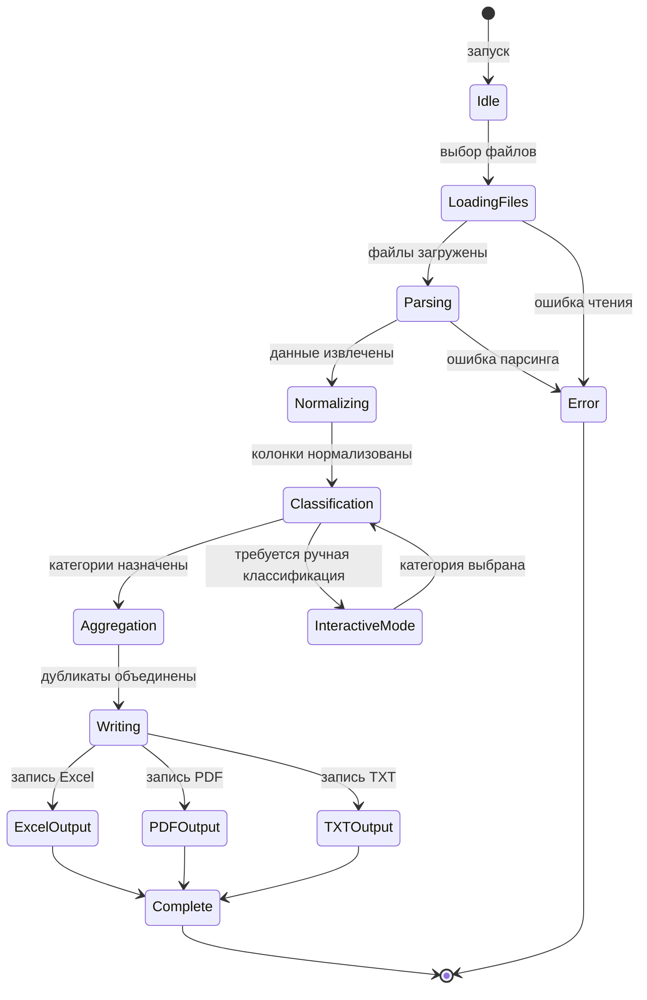
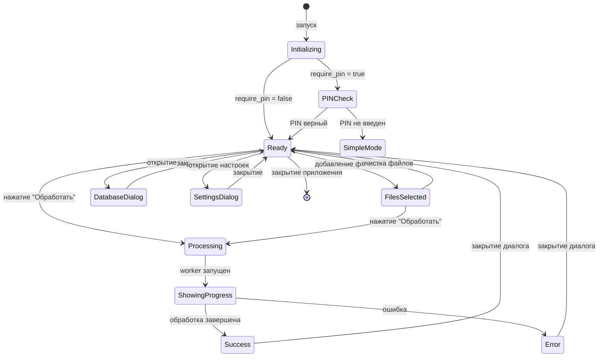
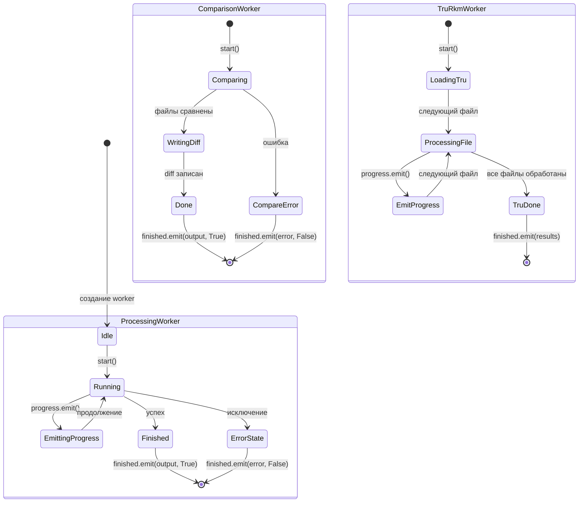
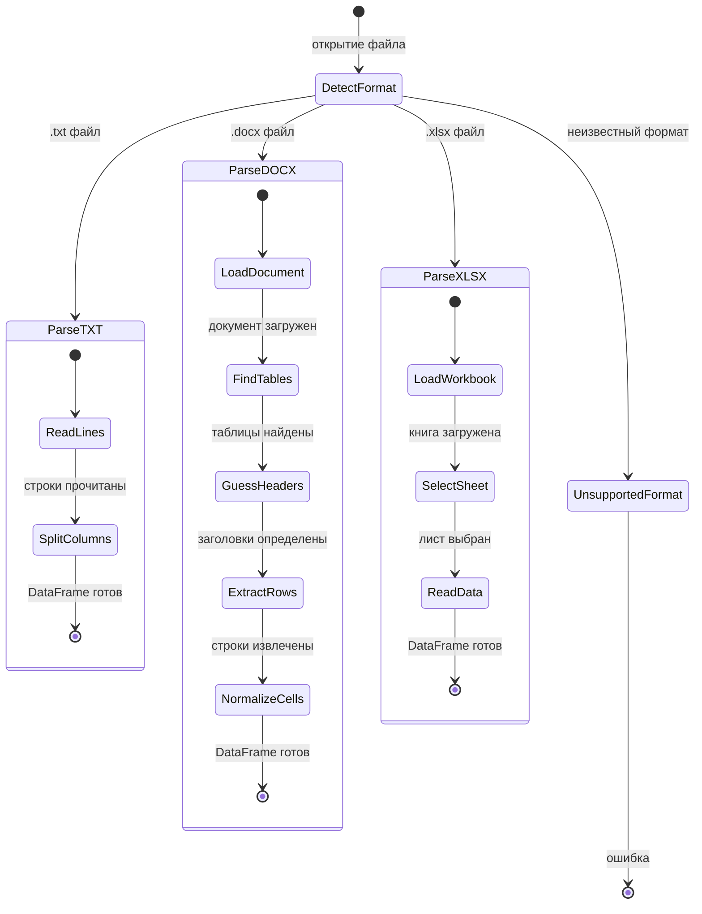
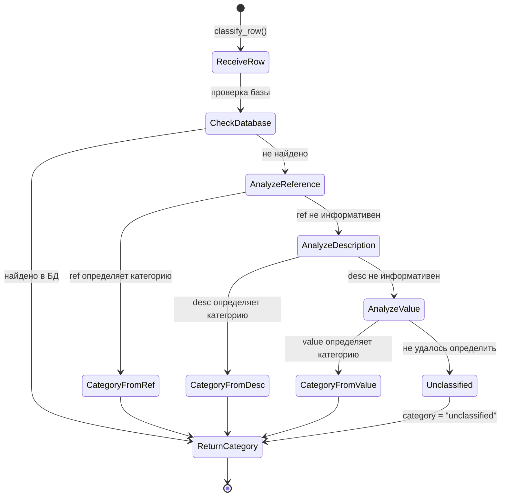
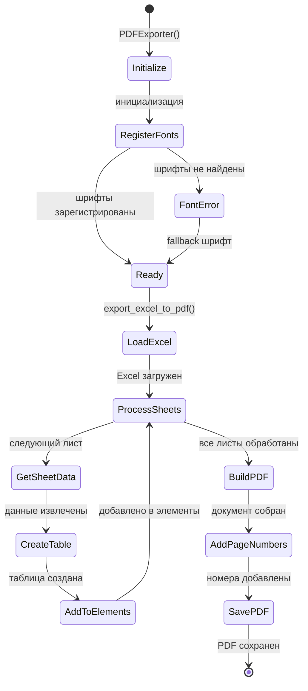

# State-Machine Diagrams for BOMCategorizer

Диаграммы состояний для основных компонентов приложения BOMCategorizer.

---

## 1. BOM Processing Pipeline (CLI)

Основной поток обработки BOM файлов в [main.py](file:///Users/olgazaharova/Project/ProjectPython/BOMCategorizer/bom_categorizer/main.py):

---

## 2. GUI Application States (Qt / Tkinter)

Состояния главного окна в [main_window.py](file:///Users/olgazaharova/Project/ProjectPython/BOMCategorizer/bom_categorizer/gui/main_window.py) и [gui.py](file:///Users/olgazaharova/Project/ProjectPython/BOMCategorizer/bom_categorizer/gui.py):

---

## 3. Worker Thread States

Состояния фоновых потоков в [workers.py](file:///Users/olgazaharova/Project/ProjectPython/BOMCategorizer/bom_categorizer/gui/workers.py):

---

## 4. File Parser States

Состояния парсеров в [parsers.py](file:///Users/olgazaharova/Project/ProjectPython/BOMCategorizer/bom_categorizer/parsers.py):

---

## 5. Classification Engine States

Состояния классификатора в [classifiers.py](file:///Users/olgazaharova/Project/ProjectPython/BOMCategorizer/bom_categorizer/classifiers.py):

---

## 6. PDF Export States

Состояния экспортера в [pdf_exporter.py](file:///Users/olgazaharova/Project/ProjectPython/BOMCategorizer/bom_categorizer/pdf_exporter.py):

