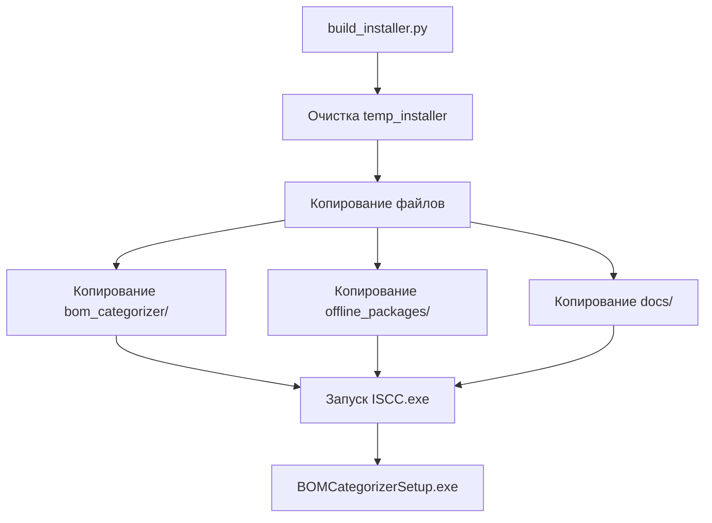

# 📁 Структура проекта BOM Categorizer

## 🗂️ Организация файлов (v3.2.2 / v4.0.0)

> 🎨 **НОВОЕ:** Проект поддерживает две независимые версии GUI:
> - **Standard v3.2.2** (Tkinter) - стабильная
> - **Modern Edition v4.0.0** (PySide6) - экспериментальная

### Корневая директория

```
ProjectSnabjenie/
├── 📄 README.md                          # Главная документация (быстрый старт)
├── 📄 BUILD.md                           # Инструкция по сборке инсталлятора (обе версии)
├── 📄 ANALYSIS_PROJECT.md                # Детальный анализ кодовой базы (v3.2.2/v4.0.0)
├── 📄 CHANGELOG.md                       # История изменений (объединенный)
├── 📄 EDITIONS.md                        # 🆕 Сравнение Standard vs Modern Edition
├── 📄 GITHUB_READY.md                    # Статус подготовки к GitHub
├── 📄 README_GITHUB.md                   # Инструкция публикации на GitHub
│
├── 🐍 app.py                             # ✅ GUI Standard Edition (Tkinter v3.2.2)
├── 🐍 app_qt.py                          # ✨ GUI Modern Edition (PySide6 v4.0.0)
├── 🐍 split_bom.py                       # CLI утилита категоризации
├── 🐍 interactive_classify.py            # Интерактивная классификация
├── 🐍 interactive_classify_improved.py   # Улучшенная версия
├── 🐍 preview_unclassified.py            # Предпросмотр неклассифицированных
│
├── 📦 bom_categorizer/                   # Модульная структура (v3.2.2/v4.0.0)
│   ├── __init__.py                       # Инициализация модуля (метаданные)
│   ├── main.py                           # CLI точка входа и оркестрация
│   ├── classifiers.py                    # Классификация компонентов
│   ├── parsers.py                        # Парсеры TXT/DOCX/Excel (унифицированная обработка)
│   ├── formatters.py                     # Форматирование данных (извлечение ТУ, нормализация)
│   ├── excel_writer.py                   # Запись Excel с форматированием
│   ├── txt_writer.py                     # Генерация TXT отчетов
│   ├── utils.py                          # Утилиты и regex
│   │
│   ├── gui.py                            # ✅ Tkinter GUI Standard (PIN защита, управление БД)
│   ├── gui_qt.py                         # ✨ PySide6 GUI Modern Edition (современный дизайн)
│   ├── dialogs_qt.py                     # ✨ PySide6 диалоги (PIN, статистика, классификация)
│   │
│   ├── component_database.py            # База данных компонентов (постоянное хранение)
│   └── podborka_extractor.py            # Извлечение компонентов для подборки
│
├── ⚙️ config.json                        # ✅ Конфигурация Standard v3.2.2 (PIN: 1234)
├── ⚙️ config_qt.json                     # ✨ Конфигурация Modern Edition v4.0.0
├── 📋 requirements.txt                   # Python зависимости (dev + test)
├── 📋 requirements_install.txt           # 🆕 Python зависимости (только runtime, для инсталлятора)
├── 📋 rules.json                         # Правила категоризации
├── 🗄️ component_database.json            # 🆕 База данных компонентов (v2.0.33+)
│
├── 🔧 build_installer.py                 # Автосборка инсталлятора (с диалогом выбора версии)
├── 🔧 build_macos.sh                     # Сборка macOS DMG (с диалогом выбора версии)
├── 🔧 rebuild_venv.ps1                   # Полная пересборка (venv + installer)
├── 🔧 manage_database.py                 # Управление базой данных (v3.0.0)
├── 🔧 database_stats.bat                 # Статистика БД (двойной клик)
├── 🔧 database_backup.bat                # Резервная копия БД
├── 🔧 database_export.bat                # Экспорт БД в Excel
├── 🔧 manage_database.bat                # Главное меню управления БД
├── 🔧 merge_component_database.py        # Слияние баз при обновлении
├── 🔧 run_app.bat                        # Запуск GUI (Windows)
├── 🔧 start_gui.bat                      # Альтернативный запуск GUI
├── 🔧 split_bom.bat                      # Запуск CLI без активации venv
├── 🔧 post_install.ps1                   # Скрипт установки (с БД в %APPDATA%)
├── 🔧 repair_install.ps1                 # Скрипт восстановления
├── 🔧 repair_install.bat                 # Обертка для восстановления
├── 🔧 installer_clean.iss                # ✅ Скрипт Inno Setup Standard
├── 🔧 installer_qt.iss                   # ✨ Скрипт Inno Setup Modern Edition
├── 📄 ЕСЛИ_НЕ_ЗАПУСКАЕТСЯ.txt             # Инструкция для пользователя
│
├── 📦 offline_packages/                  # Офлайн Python пакеты (12 wheel)
│   ├── pandas-2.3.3-cp313-cp313-win_amd64.whl
│   ├── numpy-2.3.3-cp313-cp313-win_amd64.whl
│   ├── pywin32-311-cp313-cp313-win_amd64.whl
│   └── ... (ещё 9 пакетов)
│
├── 📚 docs/                              # Документация
│   ├── 📘 QUICK_START.md                 # Руководство для начинающих (v3.1.3)
│   ├── 🎯 INTERACTIVE_MODE_GUIDE.md      # Интерактивный режим
│   ├── 📝 TXT_EXPORT_GUIDE.md            # Экспорт в TXT
│   ├── 🔧 CLI_USAGE.md                   # Использование CLI
│   ├── 🔧 BAT_FILES.md                   # Описание BAT файлов
│   ├── 📦 OFFLINE_INSTALLER.md           # Офлайн инсталлятор (v3.1.3)
│   ├── 🧪 TESTING_GUIDE.md               # Руководство по тестированию
│   ├── 🔧 REPAIR_INSTALLATION.md         # Восстановление установки (v2.0.33+)
│   ├── 📋 CLASSIFICATION_RULES.md        # Правила классификации
│   ├── 📁 PROJECT_STRUCTURE.md           # Этот файл (v3.1.3)
│   │
│   ├── 🗄️ DATABASE_MANAGEMENT_GUIDE.md   # Полное руководство по базе данных (v3.0.0+)
│   └── 🗄️ GUI_DATABASE_INFO.md           # Информация о БД в GUI (v3.0.0+)
│
├── 📂 example/                           # Примеры файлов
│   ├── all_25.xlsx                       # Пример Excel BOM
│   ├── Plata_Preobrz.xlsx                # Пример платы
│   ├── БЗ.doc                            # Пример DOC
│   ├── plata_MKVH.doc                    # Пример платы MKVH
│   └── Докупить в 2025.txt               # Пример текста
│
├── 📂 tests/                             # Система тестирования (pytest)
│   ├── test_classifiers.py              # Тесты классификации
│   ├── test_database.py                  # Тесты базы данных
│   ├── test_formatters.py                # Тесты форматирования
│   ├── test_integration.py               # Интеграционные тесты
│   └── conftest.py                       # Фикстуры pytest
│
├── 🧪 run_tests.py                       # Скрипт запуска тестов
├── 🧪 run_tests.bat                      # BAT файл для тестов
├── 🧪 test_on_examples.py                # Тестирование на примерах
├── 🧪 test_examples.bat                  # BAT файл для примеров
│
├── 📂 temp_installer/                    # Временная папка для сборки
├── 📄 BOMCategorizerSetup.exe            # ✅ Инсталлятор Standard (~25-40 МБ)
└── 📄 BOMCategorizerModernSetup.exe      # ✨ Инсталлятор Modern Edition (~35-50 МБ)
```

---

## 📚 Категории документации

### 🟢 Для пользователей (основное)
| Файл | Описание | Приоритет |
|------|----------|-----------|
| `README.md` | Главная страница, быстрый старт | ⭐⭐⭐ |
| `docs/QUICK_START.md` | Подробное руководство | ⭐⭐⭐ |
| `docs/CLI_USAGE.md` | Использование командной строки | ⭐⭐ |
| `docs/INTERACTIVE_MODE_GUIDE.md` | Интерактивная классификация | ⭐⭐ |
| `docs/TXT_EXPORT_GUIDE.md` | Экспорт результатов | ⭐⭐ |
| `docs/BAT_FILES.md` | Описание BAT файлов | ⭐ |

### 🆕 База данных компонентов (v3.0.0+)
| Файл | Описание | Приоритет |
|------|----------|-----------|
| `docs/DATABASE_MANAGEMENT_GUIDE.md` | 📖 Полное руководство по базе данных | ⭐⭐⭐ |
| `docs/GUI_DATABASE_INFO.md` | Информация о БД в GUI | ⭐⭐ |

### 🔵 Для разработчиков
| Файл | Описание | Приоритет |
|------|----------|-----------|
| `ANALYSIS_PROJECT.md` | Детальный анализ кодовой базы | ⭐⭐⭐ |
| `BUILD.md` | Сборка инсталлятора | ⭐⭐⭐ |
| `docs/OFFLINE_INSTALLER.md` | Офлайн инсталлятор | ⭐⭐⭐ |
| `docs/PROJECT_STRUCTURE.md` | Структура проекта | ⭐⭐ |

### 🟡 История и справка
| Файл | Описание | Использование |
|------|----------|---------------|
| `CHANGELOG.md` | Полная история изменений | Справка по версиям |
| `GITHUB_READY.md` | Статус подготовки к GitHub | Публикация |
| `README_GITHUB.md` | Инструкция публикации | Разработчикам |

---

## 🔄 Процесс сборки инсталлятора

### 🚀 Автоматические способы (рекомендуется)

#### Вариант 1: Быстрая сборка

```powershell
python build_installer.py
```

Скрипт `build_installer.py` автоматически:
1. Создает `temp_installer/`
2. Копирует все необходимые файлы
3. Запускает Inno Setup Compiler
4. Создает `BOMCategorizerSetup.exe`

#### Вариант 2: Полная пересборка (чистая сборка)

```powershell
.\rebuild_venv.ps1
```

Скрипт `rebuild_venv.ps1` делает **всё** (для чистой сборки):
1. 🔄 Удаляет старое `.venv`
2. ✨ Создаёт новое виртуальное окружение
3. 🔌 Активирует его
4. 📦 Устанавливает зависимости из `requirements.txt`
5. 🚀 Запускает `build_installer.py`
6. ✅ Создает `BOMCategorizerSetup.exe`

**Когда использовать `rebuild_venv.ps1`:**
- ✅ После обновления `requirements.txt`
- ✅ При проблемах с виртуальным окружением
- ✅ Перед релизом (гарантия чистой сборки)
- ✅ При переносе проекта на новый компьютер



### Копируемые файлы (v2.0.33):
1. **Python скрипты** (app.py, split_bom.py, etc.)
2. **Модульная структура** (bom_categorizer/)
3. **Конфигурация** (config.json, rules.json, requirements_install.txt)
4. **База данных** (component_database.json) - 🆕 v2.0.33
5. **Документация** (README.md, BUILD.md, docs/)
6. **Офлайн пакеты** (offline_packages/) - 12 wheel файлов
7. **Скрипты** (run_app.bat, post_install.ps1, start_gui.bat, split_bom.bat)
8. **Восстановление** (repair_install.ps1, repair_install.bat, ЕСЛИ_НЕ_ЗАПУСКАЕТСЯ.txt) - 🆕 v2.0.33
9. **Слияние БД** (merge_component_database.py) - 🆕 v2.0.33

---

## 🎯 Версии

| Версия | Дата | Основные изменения |
|--------|------|-------------------|
| **3.2.2/4.0.0** | **08.11.2025** | **🎉 ТЕКУЩАЯ ВЕРСИЯ** - Две версии GUI! Standard v3.2.2 (Tkinter, стабильная) и Modern Edition v4.0.0 (PySide6, современный дизайн). Диалоги выбора в build скриптах, отдельные конфиги и установщики. Полная документация (EDITIONS.md) |
| 3.1.3 | 07.11.2025 | Подготовка к GitHub! Пароль по умолчанию изменен на 1234, создан .gitignore, объединены changelog файлы, удалены тестовые файлы и личные данные. Проект готов к публикации |
| 3.1.2 | 05.11.2025 | Управление БД через GUI! Кнопка импорта всех компонентов из выходного файла, статистика, экспорт/импорт, резервное копирование прямо в интерфейсе. Умная генерация имен файлов, корректное извлечение ТУ с суффиксами, нормализация допусков резисторов |
| 3.0.0 | 01.11.2025 | Полная система управления базой данных компонентов! База данных с метаданными, хранение в %APPDATA%, CLI инструменты управления (export/import/backup/restore), BAT файлы, персистентное хранение |
| 2.0.33 | 31.10.2025 | Парсинг многострочных элементов, PAT подборы, база данных в инсталляторе, скрипты восстановления |
| 2.0.25 | 30.10.2025 | Улучшенная классификация префиксов, обработка замен и подборов |
| 2.0.24 | 28.10.2025 | Стабильная версия с полной системой тестирования |
| 2.0.15 | 27.10.2025 | Поддержка групповых заголовков, категория "Не ИВП", нормализация DOCX |
| 2.0.14 | 27.10.2025 | Улучшенная стабильность, финальные доработки |
| 2.0.10 | 14.10.2025 | **Унификация DOCX/XLSX**, сравнение BOM файлов, авто-исключение АМФИ, границы ячеек, улучшенная сортировка |
| 1.8.3 | 14.10.2025 | Извлечение ТУ перед агрегацией, разделение всех категорий по источникам |
| 1.8.2 | 08.10.2025 | **Перенос компонентов в GUI**, исправлена сортировка, улучшена классификация СВЧ/оптики |
| 1.7.5 | 08.10.2025 | PIN защита GUI, улучшенная интерактивная классификация |
| 1.7.4 | 08.10.2025 | Исправления интерактивной классификации |
| 1.7.3 | 08.10.2025 | Базовая PIN защита |
| 1.4.0 | 07.10.2025 | Категория "Полупроводники", улучшенная обработка DOCX |
| 1.3.3 | 07.10.2025 | DOCX группы заголовков + извлечение ТУ |
| 1.3.2 | 07.10.2025 | Исправление кодировки UTF-8 |
| 1.3.1 | 07.10.2025 | Обработка DOCX с улучшенной классификацией |
| 1.2.0 | 07.10.2025 | Форматирование Excel + сортировка по номиналам |
| 1.1.1 | 06.10.2025 | Реорганизация документации в docs/ |
| 1.1.0 | 06.10.2025 | Офлайн инсталлятор |
| 1.0.9 | 06.10.2025 | Исправления pip |
| 1.0.5 | 03.10.2025 | Базовая версия |

---

## 📦 Размеры

| Компонент | Размер |
|-----------|--------|
| offline_packages/ | ~38 МБ |
| Исходный код | ~2 МБ |
| Документация docs/ | ~100 КБ |
| **BOMCategorizerSetup.exe** | **~25-40 МБ** |

---

## 🚀 Быстрые команды

### 🎯 Сборка инсталлятора (рекомендуется):

```powershell
# Вариант 1: Быстрая сборка (если окружение настроено)
python build_installer.py

# Вариант 2: Полная пересборка (чистая сборка)
.\rebuild_venv.ps1

# При проблемах с политикой выполнения:
Set-ExecutionPolicy -Scope Process -ExecutionPolicy Bypass
.\rebuild_venv.ps1
```

### Обновление offline_packages:
```powershell
python -m pip download -r requirements.txt `
    -d offline_packages `
    --only-binary=:all: `
    --platform win_amd64 `
    --python-version 313
```

### Подготовка temp_installer (ручной способ):
```powershell
# ⚠️ Лучше использовать build_installer.py!
# Но если нужно вручную:

# Копировать основные файлы
Copy-Item -Path "app.py", "split_bom.py", "config.json", "README.md", "requirements.txt", "BUILD.md", "interactive_classify.py", "interactive_classify_improved.py", "post_install.ps1", "preview_unclassified.py", "rules.json", "run_app.bat", "split_bom.bat", "start_gui.bat", "installer_clean.iss" -Destination "temp_installer" -Force

# Копировать директории
Copy-Item -Path "bom_categorizer" -Destination "temp_installer\bom_categorizer" -Recurse -Force
Copy-Item -Path "docs" -Destination "temp_installer\docs" -Recurse -Force
Copy-Item -Path "offline_packages" -Destination "temp_installer\offline_packages" -Recurse -Force
```

### Компиляция (ручной способ):
```powershell
# ⚠️ build_installer.py делает это автоматически!
& "C:\Program Files (x86)\Inno Setup 6\iscc.exe" "installer_clean.iss"
```

---

## 📖 Навигация по документации

**С чего начать?**
1. 📄 `README.md` - общий обзор и быстрый старт
2. 📘 `docs/QUICK_START.md` - подробное руководство
3. 🎯 `docs/INTERACTIVE_MODE_GUIDE.md` - для интерактивной работы

**Разработчикам:**
1. 📊 `ANALYSIS_PROJECT.md` - детальный анализ кодовой базы, архитектура, паттерны
2. 🔧 `BUILD.md` - как собрать инсталлятор (автоматически через `build_installer.py`)
3. 📦 `docs/OFFLINE_INSTALLER.md` - про офлайн режим
4. 📁 `docs/PROJECT_STRUCTURE.md` - структура проекта (вы здесь)
5. 🐍 `build_installer.py` - скрипт автоматической сборки

**GitHub публикация:**
1. 📋 `CHANGELOG.md` - полная история версий
2. ✅ `GITHUB_READY.md` - статус подготовки
3. 📘 `README_GITHUB.md` - инструкция по публикации

---

## 📌 Основные возможности v3.2.2 / v4.0.0

### 🎨 Две версии GUI (v3.2.2/v4.0.0):

#### Standard Edition v3.2.2 (Tkinter) ✅
- **Стабильная версия** - проверенная временем
- **Tkinter GUI** - встроен в Python, не требует дополнительных зависимостей
- **Размер:** ~25-40 MB инсталлятор
- **Файлы:** app.py, config.json, installer_clean.iss
- **Конфиг:** edition "Standard"

#### Modern Edition v4.0.0 (PySide6) ✨
- **Экспериментальная версия** - современный дизайн
- **PySide6 GUI** - Qt фреймворк, лучшая кастомизация
- **Приглушенная цветовая палитра** - #5B9BD5, #67B279, #95A5A6
- **Увеличенные шрифты** - 13-14pt для лучшей читаемости
- **QSS стили** - аналог CSS для оформления
- **Размер:** ~35-50 MB инсталлятор (включая PySide6)
- **Файлы:** app_qt.py, config_qt.json, gui_qt.py, dialogs_qt.py, installer_qt.iss
- **Конфиг:** edition "Modern Edition"

#### Общая бизнес-логика:
- ✅ Обе версии используют **одинаковые модули** для парсинга, классификации и экспорта
- ✅ Совместимы с **одной базой данных** компонентов
- ✅ Создают **идентичные выходные файлы**
- ✅ Можно устанавливать **параллельно**

### 🎉 Новое в версии v3.1.3 - Подготовка к GitHub:

#### 1. Безопасность и конфиденциальность
- **Пароль по умолчанию изменен** - с 5421 на 1234 во всех файлах
- **Удалены тестовые файлы** - quick_test.py, ANALYSIS_PROJECT.md восстановлен и обновлен
- **Создан .gitignore** - защита личных данных, БД, примеров, временных файлов
- **Исключены из git** - *.exe, component_database.json, example/, temp_installer/, __pycache__/

#### 2. Документация для GitHub
- **CHANGELOG.md** - объединенная история изменений (v3.0.0 + v3.1.2)
- **GITHUB_READY.md** - краткая сводка подготовки
- **README_GITHUB.md** - подробная инструкция публикации
- **ANALYSIS_PROJECT.md** - обновлен до v3.1.3

#### 3. Готовность к публикации
- ✅ Все личные данные удалены
- ✅ Пароль изменен на дефолтный
- ✅ Создан .gitignore для защиты
- ✅ Около 110 файлов (~80 MB) исключены из репозитория
- ✅ Документация актуализирована

### 🎉 Возможности v3.1.2 - Управление БД через GUI:

#### 1. Кнопки управления базой данных в GUI (НОВОЕ!)
- **⬇️ Импорт из выходного файла** - добавление всех проверенных компонентов одной кнопкой
- **📊 Статистика** - просмотр количества компонентов по категориям
- **📤 Экспорт в Excel** - перенос базы данных на другой ПК
- **💾 Резервная копия** - создание бэкапов с временными метками
- **📥 Импорт из Excel** - загрузка базы данных с другого ПК
- **📁 Открыть папку** - быстрый доступ к файлам БД
- **🔄 Обновить инфо** - обновление информации в футере
- **Файл:** `bom_categorizer/gui.py`

#### 2. Информация о базе данных в футере GUI
- **Версия базы данных** - отслеживание версии
- **Количество компонентов** - сколько всего в базе
- **Расположение** - Project/Installation (кликабельное!)
- **Цветовая индикация** - зеленый (проект) / синий (установка)
- **Файл:** `bom_categorizer/gui.py`

#### 3. Умная генерация имен выходных файлов
- **Один файл** → `имя_файла_out.xlsx` в той же папке
- **Несколько файлов** → `out.xlsx` в папке первого файла
- **Автоматическое обновление** - при добавлении/удалении файлов
- **Файл:** `bom_categorizer/gui.py`

### 🎉 Возможности v3.0.0 - Система управления базой данных:

#### 1. Структурированная база данных с метаданными
- **Версия и дата создания** - отслеживание изменений базы данных
- **Статистика по категориям** - сколько компонентов в каждой категории
- **Общее количество компонентов** - контроль роста базы
- **Описание** - понятная информация о версии базы
- **Файл:** `bom_categorizer/component_database.py`

#### 2. Постоянное хранение данных (data persistence)
- **%APPDATA%\BOMCategorizer\Data** - база данных хранится независимо от программы
- **НЕ удаляется при деинсталляции** - ваши данные в безопасности
- **Автоматическая миграция** - при первой установке
- **Маркер установки** (`.installed`) - определение режима работы
- **Файлы:** `bom_categorizer/component_database.py`, `post_install.ps1`

#### 3. Инструменты управления базой данных
- **manage_database.py** - мощный CLI инструмент управления:
  - `--stats` - статистика базы данных
  - `--export` - экспорт в Excel (для переноса и редактирования)
  - `--import` - импорт из Excel (с объединением или заменой)
  - `--backup` - создание резервной копии
  - `--list-backups` - просмотр доступных копий
  - `--restore` - восстановление из резервной копии
  - `--clear` - очистка базы данных
- **Файл:** `manage_database.py`

#### 4. Удобные BAT файлы (двойной клик)
- **database_stats.bat** - быстрая статистика
- **database_backup.bat** - быстрая резервная копия
- **database_export.bat** - быстрый экспорт
- **manage_database.bat** - запуск главного меню
- **Кодировка UTF-8** - правильное отображение русских символов

#### 5. Интеграция с интерактивной классификацией
- **Автоматическое сохранение** - выбор сохраняется в базу данных
- **Наивысший приоритет** - база данных > rules.json > автоклассификация
- **Больше не нужно выбирать повторно** - запомнил навсегда!
- **Файл:** `bom_categorizer/gui.py`

#### 6. Полная документация по базе данных
- **README_DATABASE.md** - оглавление (начните здесь!)
- **DATABASE_GUIDE.md** - полное руководство (~18 KB)
- **DATABASE_COMMANDS.md** - как запускать команды (~8 KB)
- **DATA_STORAGE.md** - где данные и их сохранность (~24 KB)

### ✅ Критические исправления в версии v2.0.33:

#### 1. Парсинг многострочных элементов из DOC файлов
- **Проблема:** Элемент в двух строках создавал два отдельных элемента
- **Решение:** Автоматическое объединение строк по логике (reference без qty + строка с qty)
- **Файл:** `bom_categorizer/parsers.py`

#### 2. Извлечение подборных элементов PAT/РАТ
- **Проблема 1:** "PAT-3+ PAT-4+" извлекались как один элемент
- **Решение:** Дополнительное разбиение артикулов с "+"
- **Проблема 2:** Недостаточно записей в базе
- **Решение:** Расширена база (PAT-4+, PAT-5+, PAT-6+, русские варианты, с пробелами)
- **Файлы:** `bom_categorizer/podborka_extractor.py`, `component_database.json`

#### 3. Извлечение подборных номиналов резисторов
- **Проблема:** "6,8Ом" → "8 Ом" (неправильно)
- **Решение:** Извлечение ВСЕХ номиналов до разбиения по запятым
- **Результат:** "6,8Ом" → "6.8 Ом" ✅
- **Файл:** `bom_categorizer/podborka_extractor.py`

#### 4. Ложные срабатывания конденсаторов
- **Проблема:** "GRM1555C1H100G" воспринимался как "1H" (Генри)
- **Решение:** Word boundaries (`\b`) в regex паттернах
- **Файл:** `bom_categorizer/podborka_extractor.py`

#### 5. База данных компонентов в инсталляторе
- **Новое:** База включена в инсталлятор
- **Файлы:** `component_database.json`, `merge_component_database.py`
- **Особенность:** Не затирается при обновлении (автослияние)

#### 6. Скрипты восстановления установки
- **Новые файлы:**
  - `repair_install.ps1` - PowerShell скрипт
  - `repair_install.bat` - удобная обертка
  - `ЕСЛИ_НЕ_ЗАПУСКАЕТСЯ.txt` - инструкция
- **Работа без интернета:** Все пакеты в `offline_packages/`

### ✅ Новое в версии v2.0.25:
- 🎯 **Улучшенная классификация префиксов** - D/DD/DA → Микросхемы, VD → Полупроводники, умная логика для W/WS/WU
- 🆕 **Новые префиксы** - XT, XW → Разъемы; F, FU → Предохранители; VT → Полупроводники
- 🎯 **Приоритет "Наши разработки"** - любой компонент с 195-, АМФИ, ГВАТ автоматически в правильную категорию
- 🔧 **СВЧ модули** - вентили СВЧ с ГВАТ, корректоры АЧХ, усилители ВЧ правильно классифицируются
- 📋 **Обработка замен и подборов** - автоматическое извлечение из примечаний с пометками "(замена)" и "(подбор)"
  - ✅ Извлечение артикулов компонентов (GRM1555C1H1R0B, К53-65А)
  - ✅ Извлечение номиналов (1 кОм, 10 пФ, 1.5 мкГн)
  - ✅ Умное определение замен vs подборов (не путает "допускается отсутствие" с заменой)
  - ✅ Исправлены паттерны для корректного распознавания артикулов vs номиналов
- 🗑️ **Удалена категория debug_modules** - теперь три отдельные категории (Наши разработки, Отладочные платы, СВЧ модули)
- 📝 **Улучшен парсер DOCX** - групповые заголовки типа "К53-65 ОЖ0.460.107ТУ" правильно пропускаются, объединение многострочных примечаний
- 🔌 **Улучшена классификация кабелей** - сборки кабельные, шлейфы, провода

### ✅ Стабильная версия (v2.0.24):
- 🧪 **Полная система тестирования** - unit-тесты и интеграционные тесты с pytest
- 📊 **База данных компонентов** - автоматическое сохранение классификаций
- 🔄 **Перенос компонентов** - ручное исправление ошибок классификации
- ✨ **Автоматическое добавление ±** - стандартизация допусков

### 🆕 Функции v2.0.15-2.0.24:
- 🎯 **Групповые заголовки** - тип компонента из заголовка ("Микросхемы", "Резисторы") сохраняется для всех элементов группы (30+ типов)
- 🗂️ **Категория "Не ИВП"** - автоматическая фильтрация служебных записей из рамок документов, штампов и заголовков
- 🔄 **Нормализация DOCX** - разделение `note` на `ТУ` и `Производитель`, избежание ложных срабатываний
- 📋 **Расширенный список типов** - трансформаторы, датчики, реле, предохранители, оптопары, светодиоды и др.

### 🆕 Функции v2.0.10-2.0.14:
- 🔄 **Унификация DOCX/XLSX** - одинаковая обработка форматов, извлечение ТУ ПЕРЕД агрегацией
- ⚖️ **Сравнение BOM файлов** - сравнение двух файлов с отчетом о различиях по категориям
- 🚫 **Автоматическое исключение АМФИ** - элементы с "АМФИ" автоматически исключаются
- 🎨 **Границы ячеек в Excel** - тонкие черные линии со всех сторон для всех таблиц
- 🔤 **Интеллектуальная сортировка микросхем** - латинские названия перед кириллическими
- 📂 **Разделение по источникам** - все категории разделяются пустыми строками между файлами
- 🔍 **Улучшенная классификация** - оптические компоненты, сердечники, согласованные нагрузки
- 🧲 **Нормализация тире** - корректное объединение компонентов из .doc и .docx файлов
- 🔄 **Конвертация .doc → .docx** - автоматическая конвертация старых форматов Word
- 🖱️ **Вертикальная прокрутка GUI** - удобная навигация по форме с прокруткой колесом мыши
- ♻️ **Идемпотентная обработка** - возможность повторной обработки выходных файлов

### ✅ Исправления v2.0.10+:
- **Корректная агрегация** - одинаковые компоненты из разных форматов правильно объединяются
- **Сортировка по номиналу** - правильная для резисторов, конденсаторов, индуктивностей (27 Ом → 220 Ом → 1 кОм → 12 кОм → 82.5 кОм)
- **Извлечение ТУ** - корректная обработка кодов с дефисами (АЕЯР431200424-07ТУ)
- **Извлечение производителя** - импортные компоненты с "ф. Производитель" корректно обрабатываются
- **Классификация оптики** - компоненты с "photonic", "optical" не попадают в "Микросхемы"
- **СВЧ компоненты** - аттенюаторы, делители правильно классифицируются
- **Безопасная обработка данных** - обработка пустых значений, проверка на NaN

### Возможности базовой версии:
- 🔒 **PIN защита GUI** - безопасный доступ к приложению
- 🎯 **Интерактивная классификация** - визуальный диалог для нераспределенных элементов
- 📊 **Автоматическое предложение** - система предлагает классифицировать после обработки
- 💾 **Автосохранение правил** - все решения сохраняются в rules.json
- ✨ **Категория "Полупроводники"** - объединяет диоды, транзисторы, стабилитроны, оптроны
- 🔍 **Приоритет ТУ** - собственное ТУ компонента важнее группового
- 🔧 **Отладочные платы** - автоматическое определение по префиксу "A"/"А"
- 🔄 **Перенос компонентов** - ручной перенос неправильно классифицированных компонентов

### Поддерживаемые категории:
1. **Резисторы** - включая SMD коды
2. **Конденсаторы** - с сортировкой по номиналам
3. **Дроссели** (Индуктивности)
4. **Микросхемы**
5. **Разъемы** - включая Harting
6. **Отладочные платы** - по префиксу A/А
7. **Полупроводники** ⭐ НОВАЯ - диоды, транзисторы, стабилитроны, транзисторные матрицы
8. **Оптические компоненты**
9. **СВЧ модули**
10. **Кабели**
11. **Модули питания**
12. **Наши разработки**
13. **Другие** - предохранители, генераторы и т.д.
14. **Не распределено**

---

## 🆕 Детали новых функций v2.0.10

### 1. Унификация DOCX/XLSX (Критическое исправление)
- **Одинаковая обработка форматов** - DOCX и XLSX файлы обрабатываются по единому алгоритму
- **Извлечение ТУ ПЕРЕД агрегацией** - ТУ-коды извлекаются сразу после парсинга, до объединения данных
- **Корректное объединение** - одинаковые компоненты из разных форматов правильно объединяются

**Пример:**
```
XLSX:  1272ПН3Т + ТУ: АЕЯР.431320.420ТУ  (2 шт)
DOCX:  1272ПН3Т АЕЯР.431320.420ТУ         (3 шт)
       ↓ (ТУ извлекается, названия унифицируются)
Итог:  1272ПН3Т + ТУ: АЕЯР.431320.420ТУ  (5 шт) ✅
```

### 2. Автоматическая конвертация .doc → .docx
- **Обнаружение старых файлов** - автоматическое определение файлов в старом формате
- **Выбор метода конвертации** - через Word (автоматически) или вручную
- **Интеграция с Microsoft Word** - использование COM API для конвертации
- **Автоматическое обновление списка** - сконвертированные файлы заменяют оригинальные

### 3. Нормализация тире для корректного объединения
- **Проблема:** При конвертации .doc → .docx Word заменяет дефисы на типографские тире
- **Решение:** Все виды тире (EN DASH –, EM DASH —, MINUS −) приводятся к обычному дефису `-`
- **Охват:** Наименования, позиционные обозначения, номиналы и ТУ

### 4. Функция сравнения BOM файлов
- Сравнение двух файлов Excel с отчетом о различиях
- Автоматическая стандартизация перед сравнением
- Отчет: добавленные, удаленные и измененные элементы по категориям
- Доступна через GUI и CLI (`--compare`)

### 5. Улучшения Excel вывода
- **Границы ячеек** - тонкие черные линии со всех сторон
- **SUMMARY лист с форматированием** - жирные заголовки, автоподбор ширины
- **Выравнивание** - текстовые колонки слева, числа по центру
- **Удаление технических колонок** - `_extracted_tu_`, `unnamed` не показываются
- **"Примечание" всегда в конце** - последняя колонка в таблице

### 6. Улучшения GUI
- **Вертикальная прокрутка** - окно 750x700px с прокруткой
- **Прокрутка колесом мыши** - удобная навигация
- **Умное поле "Листы"** - автоматическое отключение при нескольких .xlsx
- **Удалены устаревшие элементы** - очистка от мёртвого кода

---

*Создано: 06.10.2025*  
*Обновлено: 08.11.2025*  
*Версия проекта: Standard 3.2.2 / Modern Edition 4.0.0*  
*Статус: ✅ Актуально*

