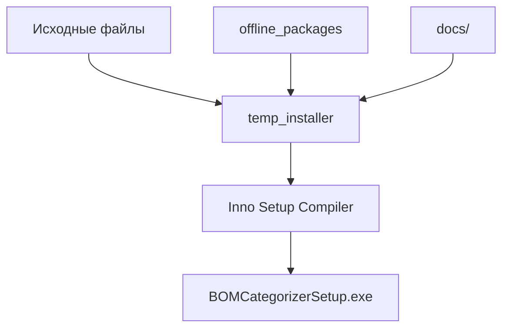

# 📁 Структура проекта BOM Categorizer

## 🗂️ Организация файлов (v1.7.5)

### Корневая директория

```
ProjectSnabjenie/
├── 📄 README.md                          # Главная документация (быстрый старт)
├── 📄 BUILD.md                           # Инструкция по сборке инсталлятора
│
├── 🐍 app.py                             # GUI приложение (tkinter)
├── 🐍 split_bom.py                       # CLI утилита категоризации
├── 🐍 interactive_classify.py            # Интерактивная классификация
├── 🐍 interactive_classify_improved.py   # Улучшенная версия
├── 🐍 preview_unclassified.py            # Предпросмотр неклассифицированных
│
├── ⚙️ config.json                        # Конфигурация приложения (v1.7.5 + PIN защита)
├── 📋 requirements.txt                   # Python зависимости
├── 📋 rules.json                         # Правила категоризации
│
├── 🔧 run_app.bat                        # Запуск GUI (Windows)
├── 🔧 start_gui.bat                      # Альтернативный запуск GUI
├── 🔧 split_bom.bat                      # Запуск CLI без активации venv
├── 🔧 post_install.ps1                   # Скрипт установки
├── 🔧 installer_clean.iss                # Скрипт Inno Setup
│
├── 📦 offline_packages/                  # Офлайн Python пакеты (12 wheel)
│   ├── pandas-2.3.3-cp313-cp313-win_amd64.whl
│   ├── numpy-2.3.3-cp313-cp313-win_amd64.whl
│   ├── pywin32-311-cp313-cp313-win_amd64.whl
│   └── ... (ещё 9 пакетов)
│
├── 📚 docs/                              # Документация
│   ├── 📘 QUICK_START.md                 # Руководство для начинающих
│   ├── 🎯 INTERACTIVE_MODE_GUIDE.md      # Интерактивный режим
│   ├── 📝 TXT_EXPORT_GUIDE.md            # Экспорт в TXT
│   ├── 🔧 CLI_USAGE.md                   # Использование CLI
│   ├── 🔧 BAT_FILES.md                   # Описание BAT файлов
│   ├── 📊 SUMMARY_OF_IMPROVEMENTS.md     # История улучшений
│   ├── 📦 OFFLINE_INSTALLER.md           # Офлайн инсталлятор
│   ├── 🚀 RELEASE_v1.3.2.md              # Описание v1.3.2
│   ├── 📋 INSTALLER_CHANGELOG.md         # История версий инсталлятора
│   ├── 🔍 INSTALL_FIX_SUMMARY.md         # Решённые проблемы
│   ├── 📜 CHANGELOG_CATEGORIZATION.md    # История категоризации
│   ├── 🐛 FIX_SUMMARY.md                 # Исправления багов
│   └── 📁 PROJECT_STRUCTURE.md           # Этот файл
│
├── 📂 example/                           # Примеры файлов
│   ├── all_25.xlsx                       # Пример Excel BOM
│   ├── Plata_Preobrz.xlsx                # Пример платы
│   ├── БЗ.doc                            # Пример DOC
│   └── Докупить в 2025.txt               # Пример текста
│
├── 📂 temp_installer/                    # Временная папка для сборки
└── 📄 BOMCategorizerSetup.exe            # Готовый инсталлятор (~39.5 МБ)
```

---

## 📚 Категории документации

### 🟢 Для пользователей (основное)
| Файл | Описание | Приоритет |
|------|----------|-----------|
| `README.md` | Главная страница, быстрый старт | ⭐⭐⭐ |
| `docs/QUICK_START.md` | Подробное руководство | ⭐⭐⭐ |
| `docs/CLI_USAGE.md` | Использование командной строки | ⭐⭐ |
| `docs/INTERACTIVE_MODE_GUIDE.md` | Интерактивная классификация | ⭐⭐ |
| `docs/TXT_EXPORT_GUIDE.md` | Экспорт результатов | ⭐⭐ |
| `docs/BAT_FILES.md` | Описание BAT файлов | ⭐ |

### 🔵 Для разработчиков
| Файл | Описание | Приоритет |
|------|----------|-----------|
| `BUILD.md` | Сборка инсталлятора | ⭐⭐⭐ |
| `docs/OFFLINE_INSTALLER.md` | Офлайн инсталлятор | ⭐⭐⭐ |
| `docs/RELEASE_v1.3.2.md` | Последний релиз | ⭐⭐ |
| `docs/PROJECT_STRUCTURE.md` | Структура проекта | ⭐⭐ |

### 🟡 История и справка
| Файл | Описание | Использование |
|------|----------|---------------|
| `docs/INSTALLER_CHANGELOG.md` | История версий инсталлятора | Справка |
| `docs/INSTALL_FIX_SUMMARY.md` | Решённые проблемы | Диагностика |
| `docs/CHANGELOG_CATEGORIZATION.md` | История категоризации | Справка |
| `docs/FIX_SUMMARY.md` | Исправления | Справка |
| `docs/SUMMARY_OF_IMPROVEMENTS.md` | Все улучшения | Обзор |

---

## 🔄 Процесс сборки инсталлятора



### Копируемые файлы:
1. **Python скрипты** (app.py, split_bom.py, etc.)
2. **Конфигурация** (config.json, rules.json, requirements.txt)
3. **Документация** (README.md, BUILD.md, docs/)
4. **Офлайн пакеты** (offline_packages/)
5. **Скрипты** (run_app.bat, post_install.ps1)

---

## 🎯 Версии

| Версия | Дата | Основные изменения |
|--------|------|-------------------|
| 1.7.5 | 08.10.2025 | PIN защита GUI, улучшенная интерактивная классификация |
| 1.7.4 | 08.10.2025 | Исправления интерактивной классификации |
| 1.7.3 | 08.10.2025 | Базовая PIN защита |
| 1.4.0 | 07.10.2025 | Категория "Полупроводники", улучшенная обработка DOCX |
| 1.3.3 | 07.10.2025 | DOCX группы заголовков + извлечение ТУ |
| 1.3.2 | 07.10.2025 | Исправление кодировки UTF-8 |
| 1.3.1 | 07.10.2025 | Обработка DOCX с улучшенной классификацией |
| 1.2.0 | 07.10.2025 | Форматирование Excel + сортировка по номиналам |
| 1.1.1 | 06.10.2025 | Реорганизация документации в docs/ |
| 1.1.0 | 06.10.2025 | Офлайн инсталлятор |
| 1.0.9 | 06.10.2025 | Исправления pip |
| 1.0.5 | 03.10.2025 | Базовая версия |

---

## 📦 Размеры

| Компонент | Размер |
|-----------|--------|
| offline_packages/ | ~38 МБ |
| Исходный код | ~2 МБ |
| Документация docs/ | ~100 КБ |
| **BOMCategorizerSetup.exe** | **~39.5 МБ** |

---

## 🚀 Быстрые команды

### Обновление offline_packages:
```powershell
python -m pip download -r requirements.txt `
    -d offline_packages `
    --only-binary=:all: `
    --platform win_amd64 `
    --python-version 313
```

### Подготовка temp_installer:
```powershell
# Копировать основные файлы
Copy-Item -Path "app.py", "split_bom.py", "config.json", "README.md", "requirements.txt", "BUILD.md", "interactive_classify.py", "interactive_classify_improved.py", "post_install.ps1", "preview_unclassified.py", "rules.json", "run_app.bat", "split_bom.bat", "start_gui.bat" -Destination "temp_installer" -Force

# Копировать директории
Copy-Item -Path "docs" -Destination "temp_installer\docs" -Recurse -Force
Copy-Item -Path "offline_packages" -Destination "temp_installer\offline_packages" -Recurse -Force
```

### Компиляция:
```powershell
& "C:\Program Files (x86)\Inno Setup 6\iscc.exe" "installer_clean.iss"
```

---

## 📖 Навигация по документации

**С чего начать?**
1. 📄 `README.md` - общий обзор и быстрый старт
2. 📘 `docs/QUICK_START.md` - подробное руководство
3. 🎯 `docs/INTERACTIVE_MODE_GUIDE.md` - для интерактивной работы

**Разработчикам:**
1. 🔧 `BUILD.md` - как собрать инсталлятор
2. 📦 `docs/OFFLINE_INSTALLER.md` - про офлайн режим
3. 📁 `docs/PROJECT_STRUCTURE.md` - структура проекта (вы здесь)

**Проблемы установки?**
1. 🔍 `docs/INSTALL_FIX_SUMMARY.md` - решённые проблемы
2. 📋 `docs/INSTALLER_CHANGELOG.md` - история версий

---

## 📌 Основные возможности v1.7.5

### Новые функции:
- 🔒 **PIN защита GUI** - безопасный доступ к приложению (PIN: 5421)
- 🎯 **Интерактивная классификация в GUI** - визуальный диалог для нераспределенных элементов
- 📊 **Автоматическое предложение** - система предлагает классифицировать после обработки
- 💾 **Автосохранение правил** - все решения сохраняются в rules.json
- ✨ **Категория "Полупроводники"** - объединяет диоды, транзисторы, стабилитроны, оптроны
- 🔍 **Приоритет ТУ** - собственное ТУ компонента важнее группового
- 🔧 **Отладочные платы** - автоматическое определение по префиксу "A"/"А"
- 📋 **Улучшенная обработка DOCX** - корректное извлечение ТУ с суффиксами `/Д6`, `/02`
- 🎯 **Умная классификация** - микросхемы с префиксом VT, но словом "Микросхема" попадают в правильную категорию
- ⚠️ **Предохранители** - всегда в категорию "Другие", независимо от группы

### Поддерживаемые категории:
1. **Резисторы** - включая SMD коды
2. **Конденсаторы** - с сортировкой по номиналам
3. **Дроссели** (Индуктивности)
4. **Микросхемы**
5. **Разъемы** - включая Harting
6. **Отладочные платы** - по префиксу A/А
7. **Полупроводники** ⭐ НОВАЯ - диоды, транзисторы, стабилитроны, транзисторные матрицы
8. **Оптические компоненты**
9. **СВЧ модули**
10. **Кабели**
11. **Модули питания**
12. **Наши разработки**
13. **Другие** - предохранители, генераторы и т.д.
14. **Не распределено**

---

*Создано: 06.10.2025*  
*Обновлено: 08.10.2025*  
*Версия проекта: 1.7.5*  
*Статус: ✅ Актуально*

