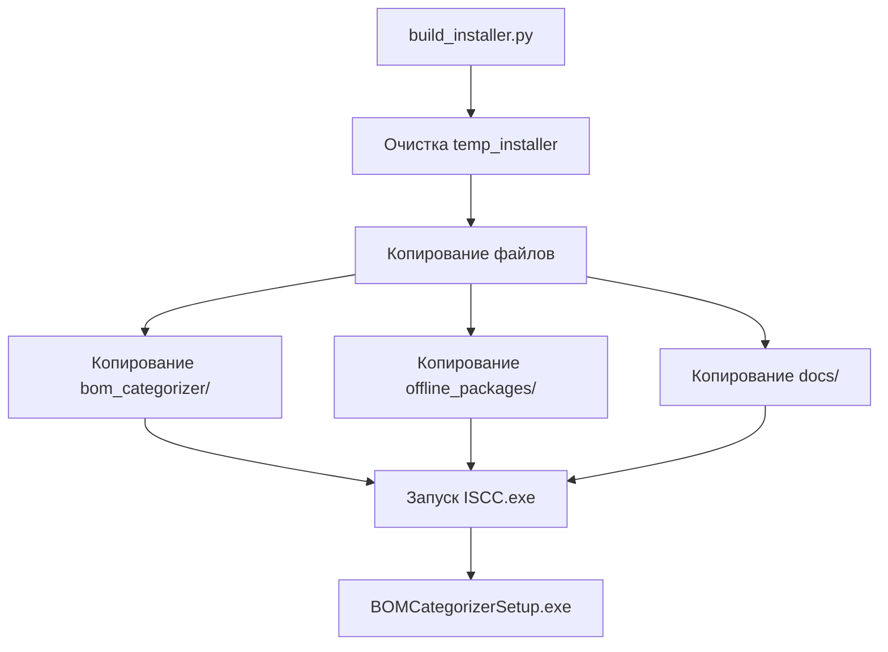

# 📁 Структура проекта BOM Categorizer

## 🗂️ Организация файлов (v2.0.27)

### Корневая директория

```
ProjectSnabjenie/
├── 📄 README.md                          # Главная документация (быстрый старт)
├── 📄 BUILD.md                           # Инструкция по сборке инсталлятора
├── 📄 ANALYSIS_PROJECT.md                # Детальный анализ кодовой базы (v2.0.15)
│
├── 🐍 app.py                             # GUI приложение (tkinter)
├── 🐍 split_bom.py                       # CLI утилита категоризации
├── 🐍 interactive_classify.py            # Интерактивная классификация
├── 🐍 interactive_classify_improved.py   # Улучшенная версия
├── 🐍 preview_unclassified.py            # Предпросмотр неклассифицированных
│
├── 📦 bom_categorizer/                   # Модульная структура (v2.0.27)
│   ├── __init__.py                       # Инициализация модуля (метаданные v2.0.27)
│   ├── main.py                           # CLI точка входа и оркестрация
│   ├── classifiers.py                    # Классификация компонентов (улучшенная классификация с поддержкой групповых заголовков)
│   ├── parsers.py                        # Парсеры TXT/DOCX/Excel (унифицированная обработка)
│   ├── formatters.py                     # Форматирование данных (извлечение ТУ, нормализация, добавление ±)
│   ├── excel_writer.py                   # Запись Excel с форматированием (границы ячеек, разделение по источникам)
│   ├── txt_writer.py                     # Генерация TXT отчетов
│   ├── utils.py                          # Утилиты и regex
│   ├── gui.py                            # Tkinter GUI (PIN защита, интерактивная классификация, перенос компонентов)
│   ├── component_database.py            # База данных компонентов
│   └── podborka_extractor.py            # Извлечение компонентов для подборки
│
├── ⚙️ config.json                        # Конфигурация приложения (PIN защита, настройки)
├── 📋 requirements.txt                   # Python зависимости
├── 📋 rules.json                         # Правила категоризации
│
├── 🔧 build_installer.py                 # 🆕 Автоматическая сборка инсталлятора
├── 🔧 rebuild_venv.ps1                   # 🆕 Полная пересборка (venv + installer)
├── 🔧 run_app.bat                        # Запуск GUI (Windows)
├── 🔧 start_gui.bat                      # Альтернативный запуск GUI
├── 🔧 split_bom.bat                      # Запуск CLI без активации venv
├── 🔧 post_install.ps1                   # Скрипт установки
├── 🔧 installer_clean.iss                # Скрипт Inno Setup
│
├── 📦 offline_packages/                  # Офлайн Python пакеты (12 wheel)
│   ├── pandas-2.3.3-cp313-cp313-win_amd64.whl
│   ├── numpy-2.3.3-cp313-cp313-win_amd64.whl
│   ├── pywin32-311-cp313-cp313-win_amd64.whl
│   └── ... (ещё 9 пакетов)
│
├── 📚 docs/                              # Документация
│   ├── 📘 QUICK_START.md                 # Руководство для начинающих
│   ├── 🎯 INTERACTIVE_MODE_GUIDE.md      # Интерактивный режим
│   ├── 📝 TXT_EXPORT_GUIDE.md            # Экспорт в TXT
│   ├── 🔧 CLI_USAGE.md                   # Использование CLI
│   ├── 🔧 BAT_FILES.md                   # Описание BAT файлов
│   ├── 📦 OFFLINE_INSTALLER.md           # Офлайн инсталлятор
│   ├── 🧪 TESTING_GUIDE.md               # Руководство по тестированию
│   ├── 🔍 INSTALL_FIX_SUMMARY.md         # Решённые проблемы
│   ├── 🐛 FIX_SUMMARY.md                 # Исправления багов
│   └── 📁 PROJECT_STRUCTURE.md           # Этот файл
│
├── 📂 example/                           # Примеры файлов
│   ├── all_25.xlsx                       # Пример Excel BOM
│   ├── Plata_Preobrz.xlsx                # Пример платы
│   ├── БЗ.doc                            # Пример DOC
│   ├── plata_MKVH.doc                    # Пример платы MKVH
│   └── Докупить в 2025.txt               # Пример текста
│
├── 📂 tests/                             # Система тестирования (pytest)
│   ├── test_classifiers.py              # Тесты классификации
│   ├── test_database.py                  # Тесты базы данных
│   ├── test_formatters.py                # Тесты форматирования
│   ├── test_integration.py               # Интеграционные тесты
│   └── conftest.py                       # Фикстуры pytest
│
├── 🧪 run_tests.py                       # Скрипт запуска тестов
├── 🧪 run_tests.bat                      # BAT файл для тестов
├── 🧪 test_on_examples.py                # Тестирование на примерах
├── 🧪 test_examples.bat                  # BAT файл для примеров
│
├── 📂 temp_installer/                    # Временная папка для сборки
└── 📄 BOMCategorizerSetup.exe            # Готовый инсталлятор (~39.5 МБ)
```

---

## 📚 Категории документации

### 🟢 Для пользователей (основное)
| Файл | Описание | Приоритет |
|------|----------|-----------|
| `README.md` | Главная страница, быстрый старт | ⭐⭐⭐ |
| `docs/QUICK_START.md` | Подробное руководство | ⭐⭐⭐ |
| `docs/CLI_USAGE.md` | Использование командной строки | ⭐⭐ |
| `docs/INTERACTIVE_MODE_GUIDE.md` | Интерактивная классификация | ⭐⭐ |
| `docs/TXT_EXPORT_GUIDE.md` | Экспорт результатов | ⭐⭐ |
| `docs/BAT_FILES.md` | Описание BAT файлов | ⭐ |

### 🔵 Для разработчиков
| Файл | Описание | Приоритет |
|------|----------|-----------|
| `ANALYSIS_PROJECT.md` | Детальный анализ кодовой базы | ⭐⭐⭐ |
| `BUILD.md` | Сборка инсталлятора | ⭐⭐⭐ |
| `docs/OFFLINE_INSTALLER.md` | Офлайн инсталлятор | ⭐⭐⭐ |
| `docs/PROJECT_STRUCTURE.md` | Структура проекта | ⭐⭐ |

### 🟡 История и справка
| Файл | Описание | Использование |
|------|----------|---------------|
| `docs/INSTALL_FIX_SUMMARY.md` | Решённые проблемы | Диагностика |
| `docs/FIX_SUMMARY.md` | Исправления | Справка |

---

## 🔄 Процесс сборки инсталлятора

### 🚀 Автоматические способы (рекомендуется)

#### Вариант 1: Быстрая сборка

```powershell
python build_installer.py
```

Скрипт `build_installer.py` автоматически:
1. Создает `temp_installer/`
2. Копирует все необходимые файлы
3. Запускает Inno Setup Compiler
4. Создает `BOMCategorizerSetup.exe`

#### Вариант 2: Полная пересборка (чистая сборка)

```powershell
.\rebuild_venv.ps1
```

Скрипт `rebuild_venv.ps1` делает **всё** (для чистой сборки):
1. 🔄 Удаляет старое `.venv`
2. ✨ Создаёт новое виртуальное окружение
3. 🔌 Активирует его
4. 📦 Устанавливает зависимости из `requirements.txt`
5. 🚀 Запускает `build_installer.py`
6. ✅ Создает `BOMCategorizerSetup.exe`

**Когда использовать `rebuild_venv.ps1`:**
- ✅ После обновления `requirements.txt`
- ✅ При проблемах с виртуальным окружением
- ✅ Перед релизом (гарантия чистой сборки)
- ✅ При переносе проекта на новый компьютер



### Копируемые файлы:
1. **Python скрипты** (app.py, split_bom.py, etc.)
2. **Модульная структура** (bom_categorizer/)
3. **Конфигурация** (config.json, rules.json, requirements.txt)
4. **Документация** (README.md, BUILD.md, docs/)
5. **Офлайн пакеты** (offline_packages/)
6. **Скрипты** (run_app.bat, post_install.ps1, start_gui.bat, split_bom.bat)

---

## 🎯 Версии

| Версия | Дата | Основные изменения |
|--------|------|-------------------|
| 2.0.27 | 30.10.2025 | **Текущая версия** - Компактное отображение подборов, автокопирование ТУ, умная агрегация |
| 2.0.25 | 30.10.2025 | Улучшенная классификация префиксов, обработка замен и подборов |
| 2.0.24 | 28.10.2025 | Стабильная версия с полной системой тестирования |
| 2.0.15 | 27.10.2025 | Поддержка групповых заголовков, категория "Не ИВП", нормализация DOCX |
| 2.0.14 | 27.10.2025 | Улучшенная стабильность, финальные доработки |
| 2.0.10 | 14.10.2025 | **Унификация DOCX/XLSX**, сравнение BOM файлов, авто-исключение АМФИ, границы ячеек, улучшенная сортировка |
| 1.8.3 | 14.10.2025 | Извлечение ТУ перед агрегацией, разделение всех категорий по источникам |
| 1.8.2 | 08.10.2025 | **Перенос компонентов в GUI**, исправлена сортировка, улучшена классификация СВЧ/оптики |
| 1.7.5 | 08.10.2025 | PIN защита GUI, улучшенная интерактивная классификация |
| 1.7.4 | 08.10.2025 | Исправления интерактивной классификации |
| 1.7.3 | 08.10.2025 | Базовая PIN защита |
| 1.4.0 | 07.10.2025 | Категория "Полупроводники", улучшенная обработка DOCX |
| 1.3.3 | 07.10.2025 | DOCX группы заголовков + извлечение ТУ |
| 1.3.2 | 07.10.2025 | Исправление кодировки UTF-8 |
| 1.3.1 | 07.10.2025 | Обработка DOCX с улучшенной классификацией |
| 1.2.0 | 07.10.2025 | Форматирование Excel + сортировка по номиналам |
| 1.1.1 | 06.10.2025 | Реорганизация документации в docs/ |
| 1.1.0 | 06.10.2025 | Офлайн инсталлятор |
| 1.0.9 | 06.10.2025 | Исправления pip |
| 1.0.5 | 03.10.2025 | Базовая версия |

---

## 📦 Размеры

| Компонент | Размер |
|-----------|--------|
| offline_packages/ | ~38 МБ |
| Исходный код | ~2 МБ |
| Документация docs/ | ~100 КБ |
| **BOMCategorizerSetup.exe** | **~25-40 МБ** |

---

## 🚀 Быстрые команды

### 🎯 Сборка инсталлятора (рекомендуется):

```powershell
# Вариант 1: Быстрая сборка (если окружение настроено)
python build_installer.py

# Вариант 2: Полная пересборка (чистая сборка)
.\rebuild_venv.ps1

# При проблемах с политикой выполнения:
Set-ExecutionPolicy -Scope Process -ExecutionPolicy Bypass
.\rebuild_venv.ps1
```

### Обновление offline_packages:
```powershell
python -m pip download -r requirements.txt `
    -d offline_packages `
    --only-binary=:all: `
    --platform win_amd64 `
    --python-version 313
```

### Подготовка temp_installer (ручной способ):
```powershell
# ⚠️ Лучше использовать build_installer.py!
# Но если нужно вручную:

# Копировать основные файлы
Copy-Item -Path "app.py", "split_bom.py", "config.json", "README.md", "requirements.txt", "BUILD.md", "interactive_classify.py", "interactive_classify_improved.py", "post_install.ps1", "preview_unclassified.py", "rules.json", "run_app.bat", "split_bom.bat", "start_gui.bat", "installer_clean.iss" -Destination "temp_installer" -Force

# Копировать директории
Copy-Item -Path "bom_categorizer" -Destination "temp_installer\bom_categorizer" -Recurse -Force
Copy-Item -Path "docs" -Destination "temp_installer\docs" -Recurse -Force
Copy-Item -Path "offline_packages" -Destination "temp_installer\offline_packages" -Recurse -Force
```

### Компиляция (ручной способ):
```powershell
# ⚠️ build_installer.py делает это автоматически!
& "C:\Program Files (x86)\Inno Setup 6\iscc.exe" "installer_clean.iss"
```

---

## 📖 Навигация по документации

**С чего начать?**
1. 📄 `README.md` - общий обзор и быстрый старт
2. 📘 `docs/QUICK_START.md` - подробное руководство
3. 🎯 `docs/INTERACTIVE_MODE_GUIDE.md` - для интерактивной работы

**Разработчикам:**
1. 📊 `ANALYSIS_PROJECT.md` - детальный анализ кодовой базы, архитектура, паттерны
2. 🔧 `BUILD.md` - как собрать инсталлятор (автоматически через `build_installer.py`)
3. 📦 `docs/OFFLINE_INSTALLER.md` - про офлайн режим
4. 📁 `docs/PROJECT_STRUCTURE.md` - структура проекта (вы здесь)
5. 🐍 `build_installer.py` - скрипт автоматической сборки

**Проблемы установки?**
1. 🔍 `docs/INSTALL_FIX_SUMMARY.md` - решённые проблемы
2. 🐛 `docs/FIX_SUMMARY.md` - исправления багов

---

## 📌 Основные возможности v2.0.27

### ✅ Новое в версии v2.0.27:
- 📦 **Компактное отображение подборов/замен** - умная агрегация источников
  - ✅ Вместо: `Plata_preobrz.docx (подбор) для R48*` × 2 строки
  - ✅ Теперь: `Plata_preobrz.docx, (п/б R48*), (п/б R49*)` × 1 строка
  - ✅ Экономия: ~50% длины строки (42 символа вместо 80+)
  - ✅ Автоматическое суммирование количества (1+1=2)
- 📋 **Автоматическое копирование ТУ** - ТУ копируется из оригинала в подборы/замены
  - ✅ Для XLSX: копируется из колонки `ТУ`
  - ✅ Для DOCX: копируется из поля `note` (если содержит ТУ-код)
  - ✅ Проверка паттерна ТУ: `АЛЯР.434110.005 ТУ`
- 🔧 **Умная агрегация подборов** - постобработка после стандартной агрегации
  - ✅ Подборы с одинаковым описанием объединяются
  - ✅ Источники компактно объединяются: `file.docx, (п/б R1*), (п/б R2*)`
  - ✅ Количество суммируется
- 🏷️ **Сокращения для компактности**
  - ✅ "(подбор)" → "(п/б)"
  - ✅ "(замена)" → "(зам)"
  - ✅ Поддержка обеих форм в классификаторе

### ✅ Новое в версии v2.0.25:
- 🎯 **Улучшенная классификация префиксов** - D/DD/DA → Микросхемы, VD → Полупроводники, умная логика для W/WS/WU
- 🆕 **Новые префиксы** - XT, XW → Разъемы; F, FU → Предохранители; VT → Полупроводники
- 🎯 **Приоритет "Наши разработки"** - любой компонент с 195-, АМФИ, ГВАТ автоматически в правильную категорию
- 🔧 **СВЧ модули** - вентили СВЧ с ГВАТ, корректоры АЧХ, усилители ВЧ правильно классифицируются
- 📋 **Обработка замен и подборов** - автоматическое извлечение из примечаний с пометками "(замена)" и "(подбор)"
  - ✅ Извлечение артикулов компонентов (GRM1555C1H1R0B, К53-65А)
  - ✅ Извлечение номиналов (1 кОм, 10 пФ, 1.5 мкГн)
  - ✅ Умное определение замен vs подборов (не путает "допускается отсутствие" с заменой)
  - ✅ Исправлены паттерны для корректного распознавания артикулов vs номиналов
- 🗑️ **Удалена категория debug_modules** - теперь три отдельные категории (Наши разработки, Отладочные платы, СВЧ модули)
- 📝 **Улучшен парсер DOCX** - групповые заголовки типа "К53-65 ОЖ0.460.107ТУ" правильно пропускаются, объединение многострочных примечаний
- 🔌 **Улучшена классификация кабелей** - сборки кабельные, шлейфы, провода

### ✅ Стабильная версия (v2.0.24):
- 🧪 **Полная система тестирования** - unit-тесты и интеграционные тесты с pytest
- 📊 **База данных компонентов** - автоматическое сохранение классификаций
- 🔄 **Перенос компонентов** - ручное исправление ошибок классификации
- ✨ **Автоматическое добавление ±** - стандартизация допусков

### 🆕 Функции v2.0.15-2.0.24:
- 🎯 **Групповые заголовки** - тип компонента из заголовка ("Микросхемы", "Резисторы") сохраняется для всех элементов группы (30+ типов)
- 🗂️ **Категория "Не ИВП"** - автоматическая фильтрация служебных записей из рамок документов, штампов и заголовков
- 🔄 **Нормализация DOCX** - разделение `note` на `ТУ` и `Производитель`, избежание ложных срабатываний
- 📋 **Расширенный список типов** - трансформаторы, датчики, реле, предохранители, оптопары, светодиоды и др.

### 🆕 Функции v2.0.10-2.0.14:
- 🔄 **Унификация DOCX/XLSX** - одинаковая обработка форматов, извлечение ТУ ПЕРЕД агрегацией
- ⚖️ **Сравнение BOM файлов** - сравнение двух файлов с отчетом о различиях по категориям
- 🚫 **Автоматическое исключение АМФИ** - элементы с "АМФИ" автоматически исключаются
- 🎨 **Границы ячеек в Excel** - тонкие черные линии со всех сторон для всех таблиц
- 🔤 **Интеллектуальная сортировка микросхем** - латинские названия перед кириллическими
- 📂 **Разделение по источникам** - все категории разделяются пустыми строками между файлами
- 🔍 **Улучшенная классификация** - оптические компоненты, сердечники, согласованные нагрузки
- 🧲 **Нормализация тире** - корректное объединение компонентов из .doc и .docx файлов
- 🔄 **Конвертация .doc → .docx** - автоматическая конвертация старых форматов Word
- 🖱️ **Вертикальная прокрутка GUI** - удобная навигация по форме с прокруткой колесом мыши
- ♻️ **Идемпотентная обработка** - возможность повторной обработки выходных файлов

### ✅ Исправления v2.0.10+:
- **Корректная агрегация** - одинаковые компоненты из разных форматов правильно объединяются
- **Сортировка по номиналу** - правильная для резисторов, конденсаторов, индуктивностей (27 Ом → 220 Ом → 1 кОм → 12 кОм → 82.5 кОм)
- **Извлечение ТУ** - корректная обработка кодов с дефисами (АЕЯР431200424-07ТУ)
- **Извлечение производителя** - импортные компоненты с "ф. Производитель" корректно обрабатываются
- **Классификация оптики** - компоненты с "photonic", "optical" не попадают в "Микросхемы"
- **СВЧ компоненты** - аттенюаторы, делители правильно классифицируются
- **Безопасная обработка данных** - обработка пустых значений, проверка на NaN

### Возможности базовой версии:
- 🔒 **PIN защита GUI** - безопасный доступ к приложению
- 🎯 **Интерактивная классификация** - визуальный диалог для нераспределенных элементов
- 📊 **Автоматическое предложение** - система предлагает классифицировать после обработки
- 💾 **Автосохранение правил** - все решения сохраняются в rules.json
- ✨ **Категория "Полупроводники"** - объединяет диоды, транзисторы, стабилитроны, оптроны
- 🔍 **Приоритет ТУ** - собственное ТУ компонента важнее группового
- 🔧 **Отладочные платы** - автоматическое определение по префиксу "A"/"А"
- 🔄 **Перенос компонентов** - ручной перенос неправильно классифицированных компонентов

### Поддерживаемые категории:
1. **Резисторы** - включая SMD коды
2. **Конденсаторы** - с сортировкой по номиналам
3. **Дроссели** (Индуктивности)
4. **Микросхемы**
5. **Разъемы** - включая Harting
6. **Отладочные платы** - по префиксу A/А
7. **Полупроводники** ⭐ НОВАЯ - диоды, транзисторы, стабилитроны, транзисторные матрицы
8. **Оптические компоненты**
9. **СВЧ модули**
10. **Кабели**
11. **Модули питания**
12. **Наши разработки**
13. **Другие** - предохранители, генераторы и т.д.
14. **Не распределено**

---

## 🆕 Детали новых функций v2.0.10

### 1. Унификация DOCX/XLSX (Критическое исправление)
- **Одинаковая обработка форматов** - DOCX и XLSX файлы обрабатываются по единому алгоритму
- **Извлечение ТУ ПЕРЕД агрегацией** - ТУ-коды извлекаются сразу после парсинга, до объединения данных
- **Корректное объединение** - одинаковые компоненты из разных форматов правильно объединяются

**Пример:**
```
XLSX:  1272ПН3Т + ТУ: АЕЯР.431320.420ТУ  (2 шт)
DOCX:  1272ПН3Т АЕЯР.431320.420ТУ         (3 шт)
       ↓ (ТУ извлекается, названия унифицируются)
Итог:  1272ПН3Т + ТУ: АЕЯР.431320.420ТУ  (5 шт) ✅
```

### 2. Автоматическая конвертация .doc → .docx
- **Обнаружение старых файлов** - автоматическое определение файлов в старом формате
- **Выбор метода конвертации** - через Word (автоматически) или вручную
- **Интеграция с Microsoft Word** - использование COM API для конвертации
- **Автоматическое обновление списка** - сконвертированные файлы заменяют оригинальные

### 3. Нормализация тире для корректного объединения
- **Проблема:** При конвертации .doc → .docx Word заменяет дефисы на типографские тире
- **Решение:** Все виды тире (EN DASH –, EM DASH —, MINUS −) приводятся к обычному дефису `-`
- **Охват:** Наименования, позиционные обозначения, номиналы и ТУ

### 4. Функция сравнения BOM файлов
- Сравнение двух файлов Excel с отчетом о различиях
- Автоматическая стандартизация перед сравнением
- Отчет: добавленные, удаленные и измененные элементы по категориям
- Доступна через GUI и CLI (`--compare`)

### 5. Улучшения Excel вывода
- **Границы ячеек** - тонкие черные линии со всех сторон
- **SUMMARY лист с форматированием** - жирные заголовки, автоподбор ширины
- **Выравнивание** - текстовые колонки слева, числа по центру
- **Удаление технических колонок** - `_extracted_tu_`, `unnamed` не показываются
- **"Примечание" всегда в конце** - последняя колонка в таблице

### 6. Улучшения GUI
- **Вертикальная прокрутка** - окно 750x700px с прокруткой
- **Прокрутка колесом мыши** - удобная навигация
- **Умное поле "Листы"** - автоматическое отключение при нескольких .xlsx
- **Удалены устаревшие элементы** - очистка от мёртвого кода

---

*Создано: 06.10.2025*  
*Обновлено: 30.10.2025*  
*Версия проекта: 2.0.27*  
*Статус: ✅ Актуально*

